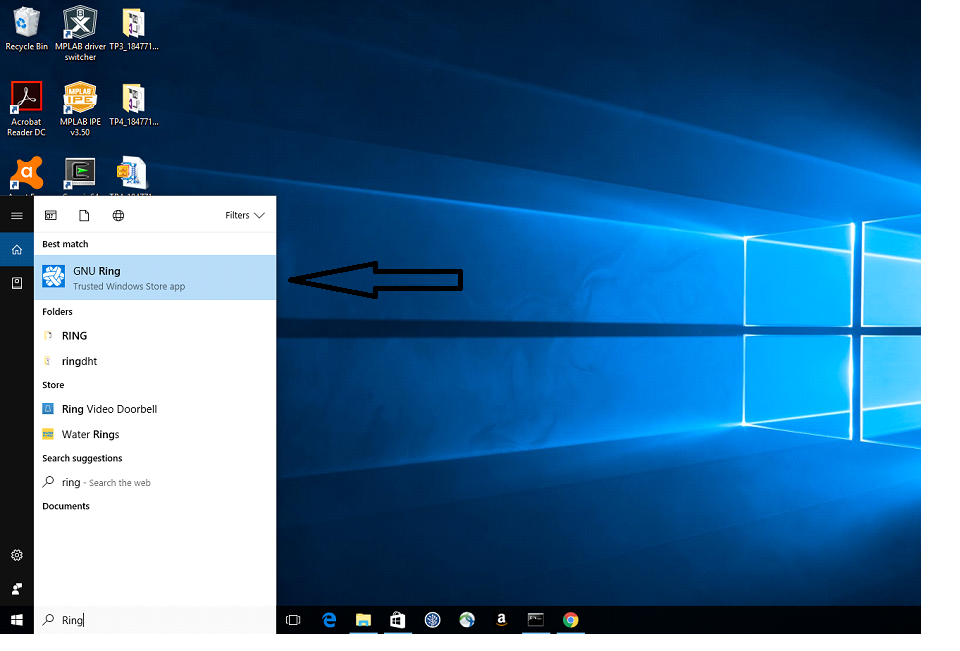
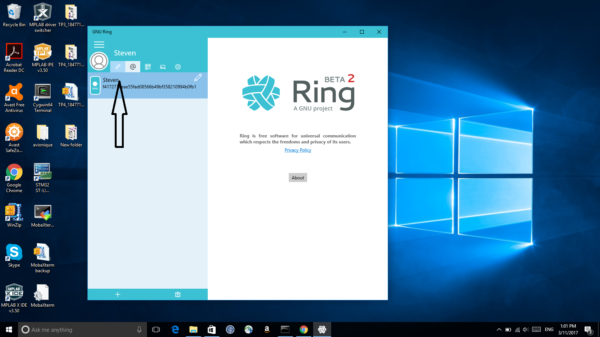
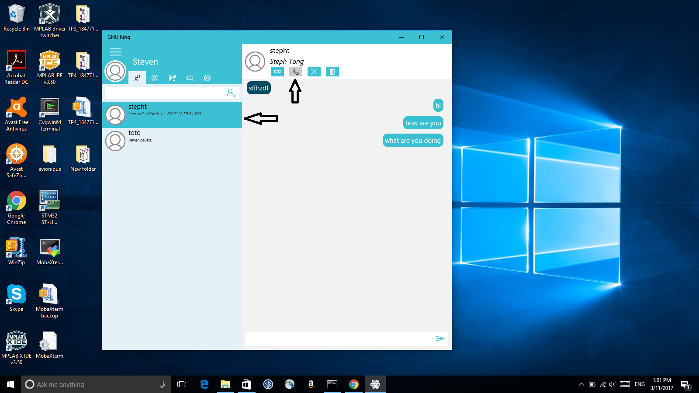
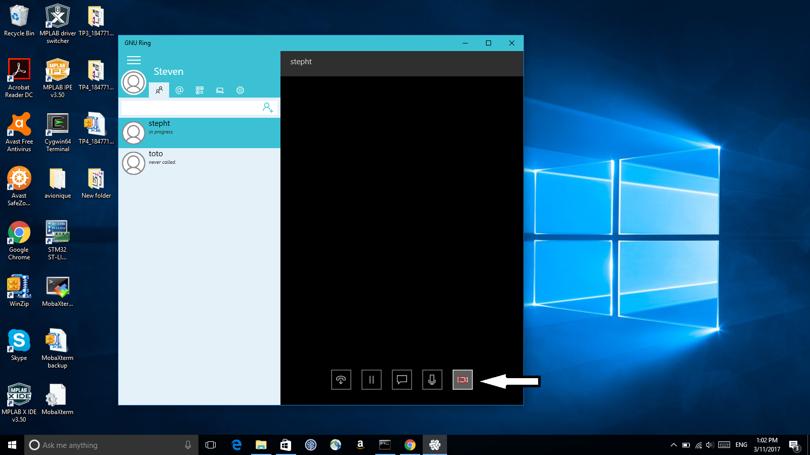

Documentation pour faire un appel audio
================================
Bien suivre les 4 etapes

Etape 1 
------
Chercher l'application RING 

Etape 2
------

Aller dans la liste de contact et chercher ola personne qui appeler

Etape 3
------

Appler la personne choisi

Etape 4
------

Retirer l'option d'appel video

