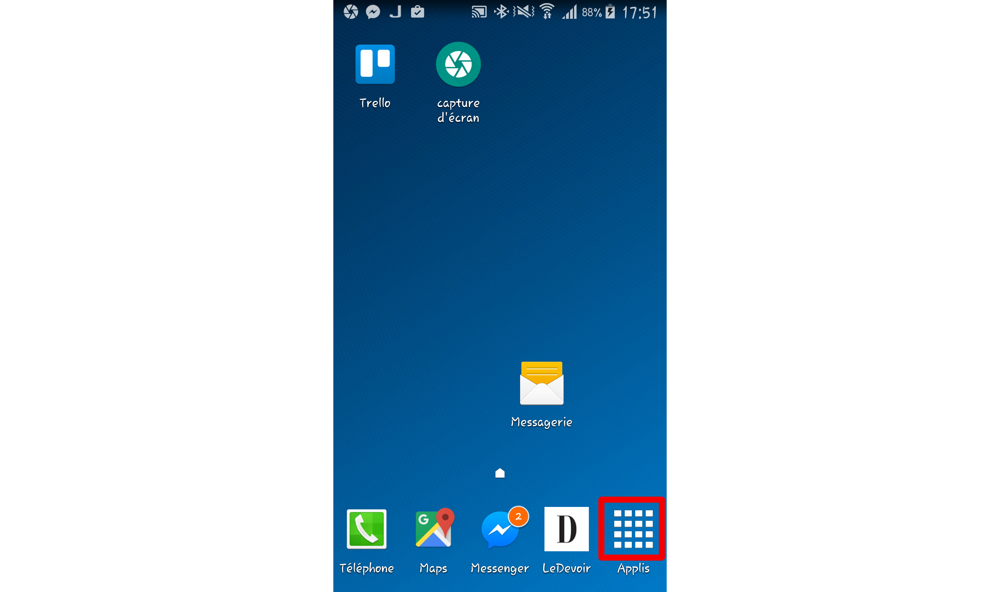
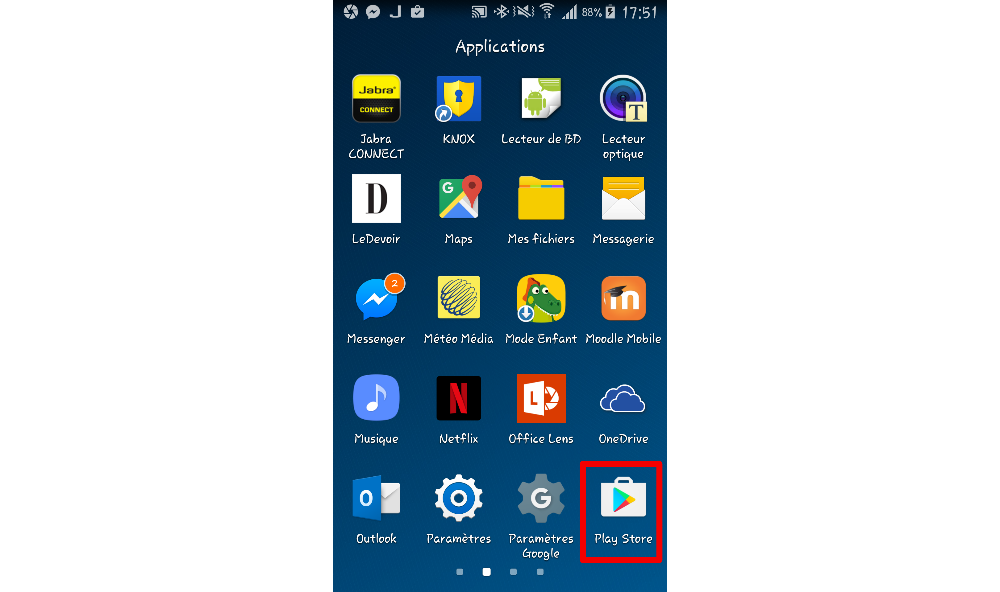
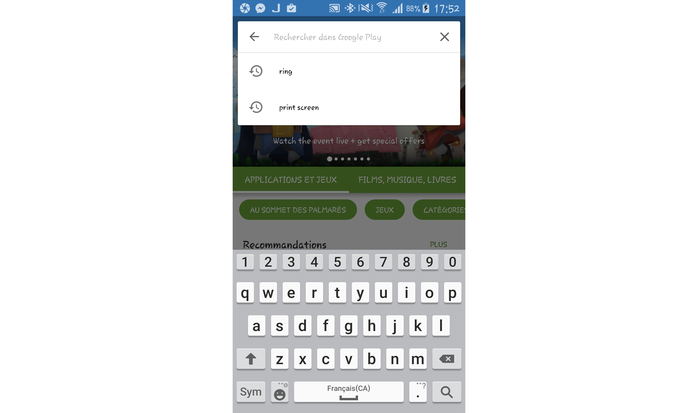
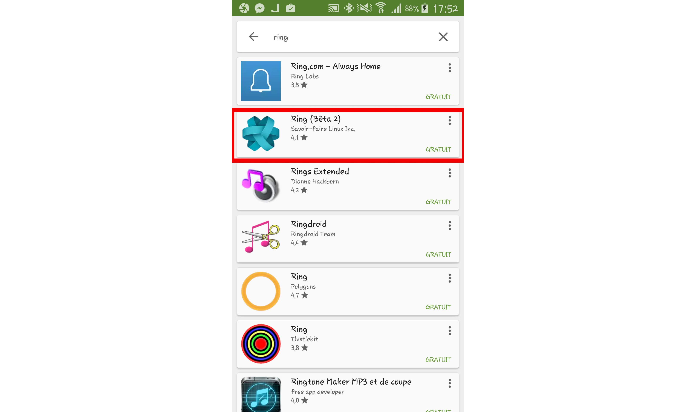
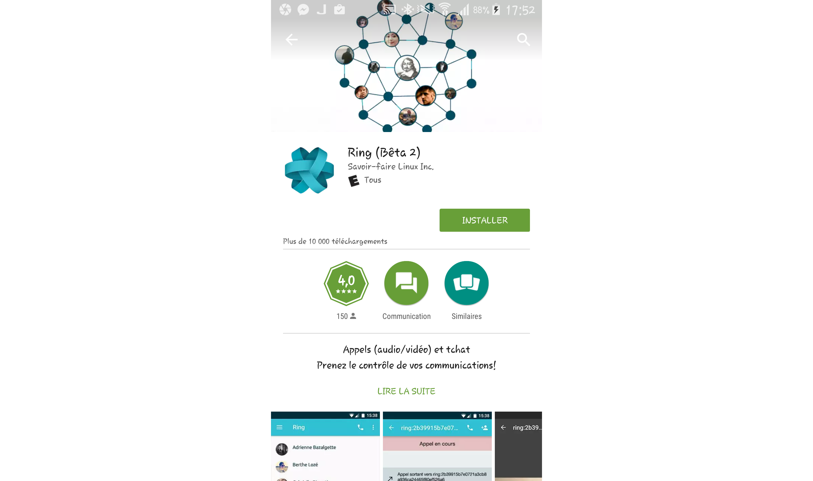
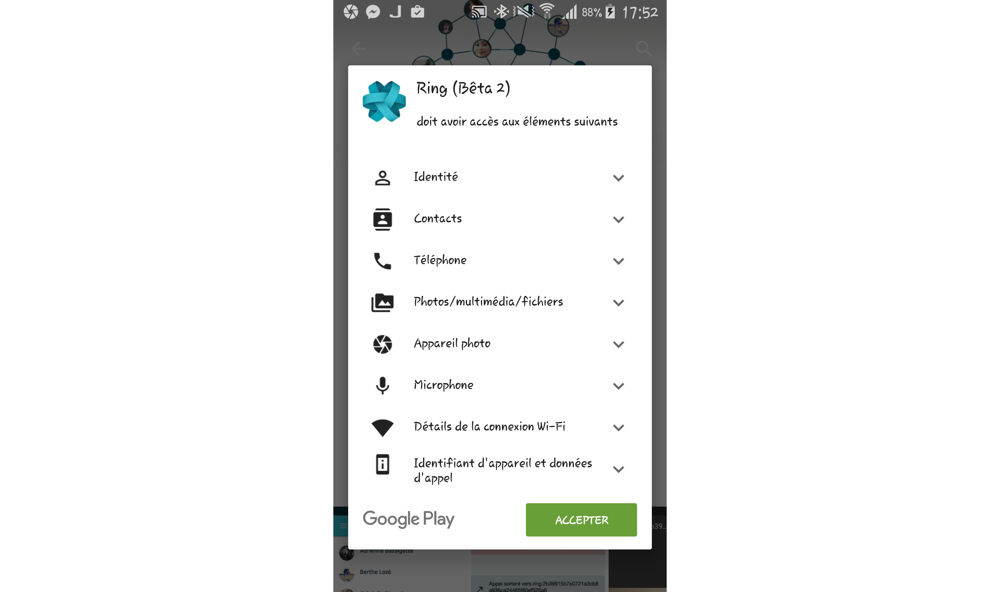
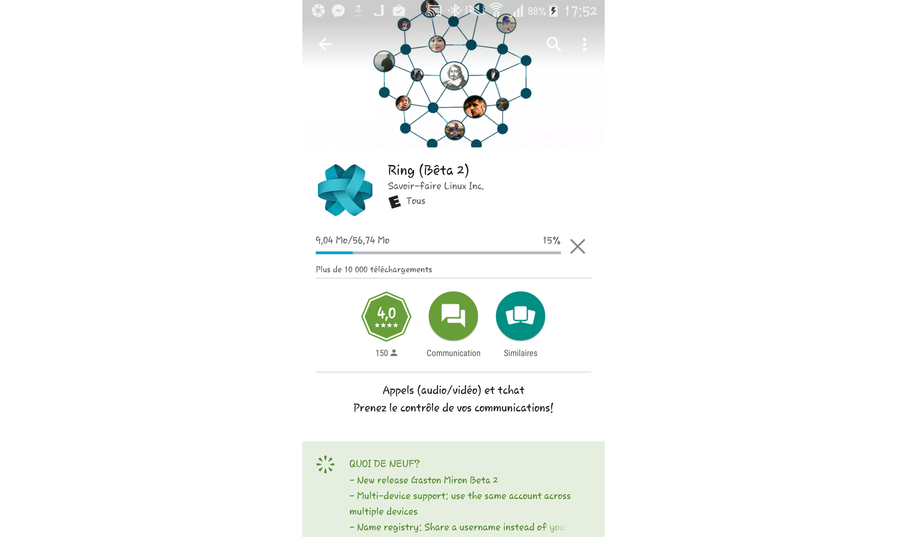
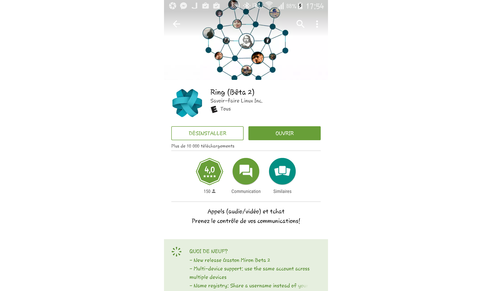
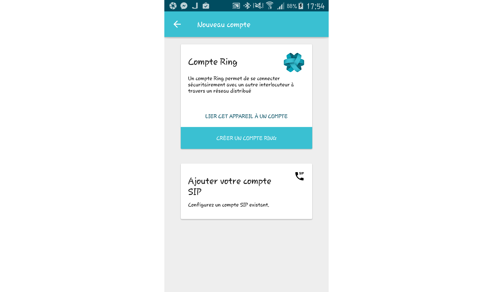

==========================================
Télécharger et installer le client Android
==========================================

Le logiciel Ring  est disponible sur plusieurs plateformes, y compris la plateforme Android. 
Il est très simple d'installer le client Android, pour ce faire il suffit de suivre ces quelques étapes:

Étape 1
-------
À partir de votre écran d'accueil, accéder à votre liste d'applications.

Étape 2
-------
Appuyez sur l'application "Play Store"

Étape 3
-------
Au haut de l'application, appuyez sur la barre de recherche, et écrivez "Ring"

Étape 4
-------
Dans la liste des résultats obtenus, cliquez sur "Ring (Bêta 2)"

Étape 5
-------
Dans la page de l'application, appuyez sur le bouton "INSTALLER"

Étape 6
-------
Dans la fenêtre qui vient d'apparaître, prenez le temps de lire les permissions qui sont requises par l'application "Ring", 
et si vous êtes d'accord avec ces permissions, appuyez sur "ACCEPTER". Le logiciel devrait alors commencer à se télécharger.

Étape 7
-------
Lorsque le logiciel aura fini de s'installer, vous pouvez cliquer sur le bouton "OUVRIR", et voilà, 
le client Ring pour Android s'ouvre! Vous pouvez maintenant lier cet appareil à un compte ring existant ou bien vous créer un compte Ring.

