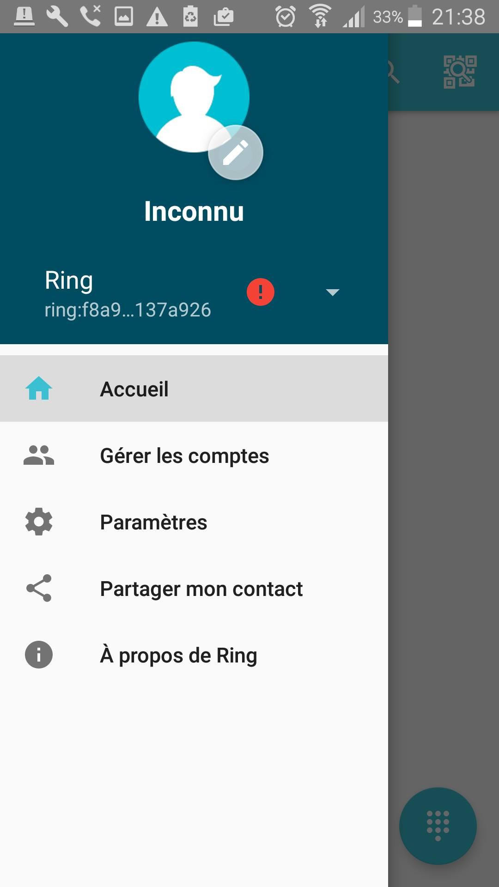
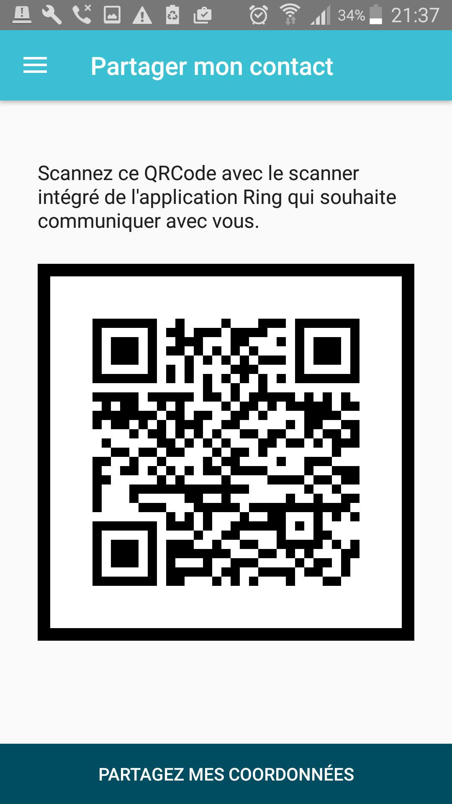
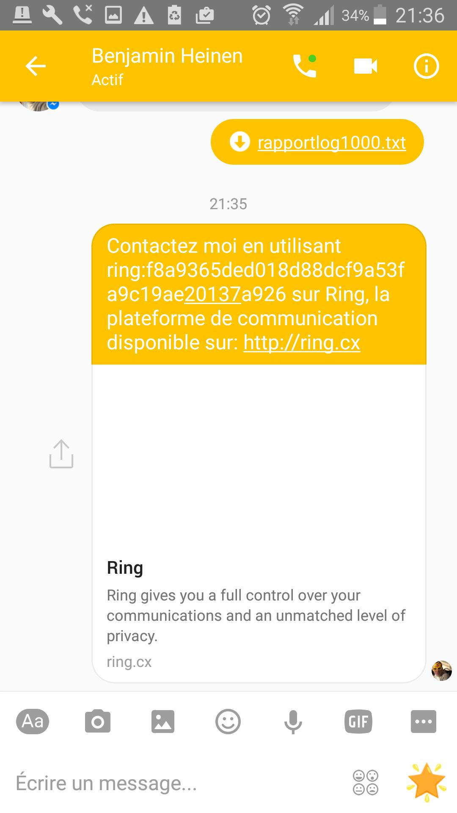

Partage de RingId par facebook (version Android)
========================================================
Une fois que vous avez pris l'application en main, vous souhaiterez peut être envoyer votre RingId à vos amis.
Pour ce faire, l'un des moyens les plus aisé et d'utiliser le reseau social facebook

Comment faire ?

Tout d'abord, connectez vous à l'application, puis ouvrez le menu, comme montrez dans l'image ci-dessous.

Par la suite, appuyez sur le bouton "partager mon contact". Vous devriez alors obtenir l'écran ci-dessous.

Enfin, il ne vous reste plus qu'à utiliser le bouton "partager mes coordonnées" et de choisir l'application facebook ou messenger. Vous pourrez alors choisir les contacts qui recevront votre RingId, sous la forme d'un message, comme présenté dans l'image ci-dessous.

