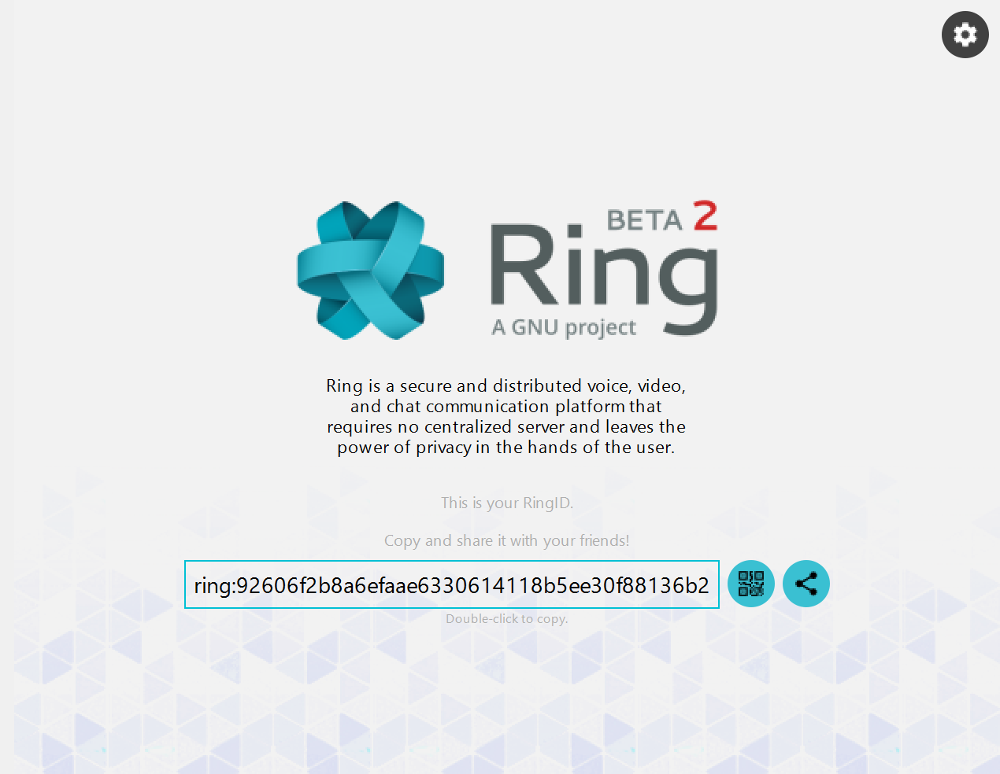
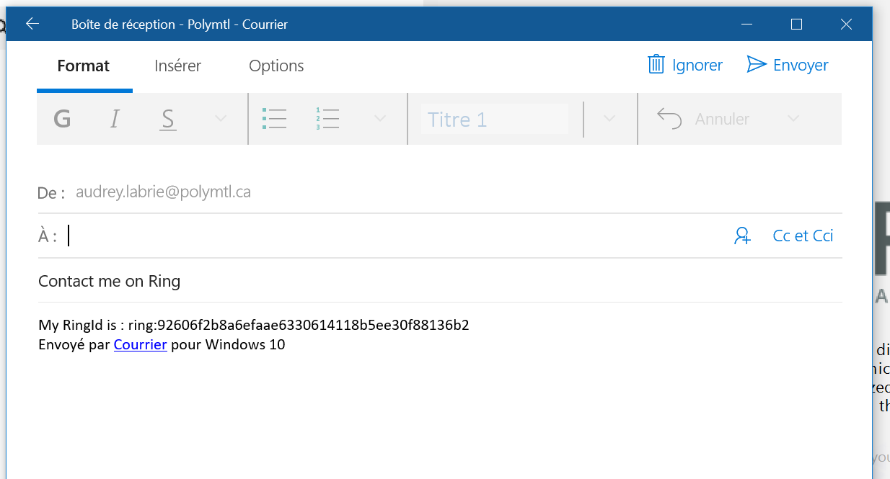
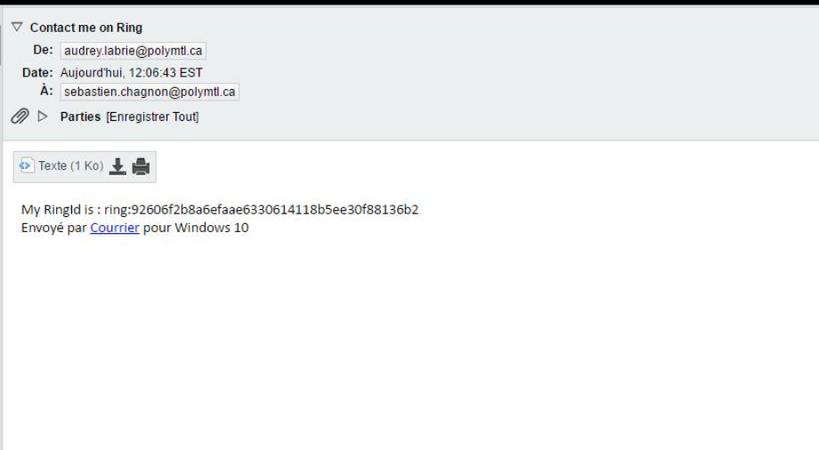

Partagez votre RingID par courriel
=========================================================================

Après avoir accédé à l’écran d’accueil, suivre les étapes suivantes afin de partager votre RingID par courriel.

**1.**  À la page d’accueil, cliquer sur le bouton *Partager*.

La fenêtre suivante souvrira.

**2.**  Entrer le nom du destinataire. Vous pouvez également ajouter un message personnalisé.

**3.**  Cliquer sur *Envoyer*. Votre destinataire recevra le courriel suivant.

