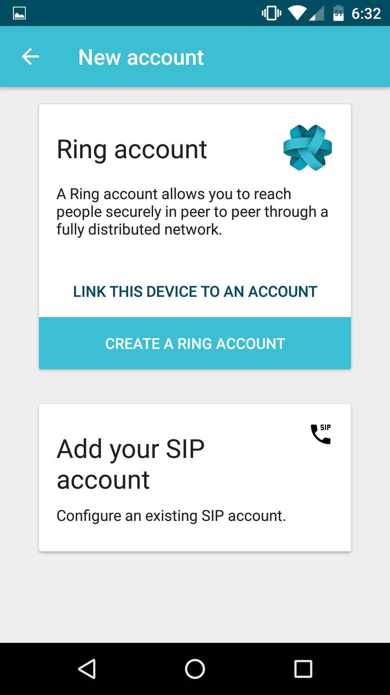

========================================================
Download and install Ring on Android
========================================================

Ring is a communication software that can be used on multiple platforms including Android! Follow this tutorial to install Ring on your Android device.

-----------------
Step 1: Open Google Play Store
-----------------

	:height: 300px
 	:width: 150 px
   	:scale: 100 %
   	:alt: alternate text
   	:align: center

Open the Google Play Store from your app folder.

------------------------------------------------
Step 2: Search for "ring savoir-faire-linux"
------------------------------------------------

Use the search bar on the top to find the Ring app quicker. Write "ring savoir-faire-linux" and press the search icon on the bottom right of the screen to launch the search.

------------------------------------------------
Step 3: Click on "Ring (Beta 2)"
------------------------------------------------

The Ring app is the one on the top of the search results. Click on the app named "Ring (Beta 2)" from Savoir-faire Linux Inc. 

------------------------------------------------
Step 4: Install Ring
------------------------------------------------

Click on "Install" to download and install Ring on your Android device.

------------------------------------------------
Step 5: Open Ring
------------------------------------------------

Ring is now installed and you can open the app from the Play Store or from the app drawer of your device.

------------------------------------------------
Step 6: Almost there...
------------------------------------------------

When the app is opened for the first time, you will be asked to give Ring permissions to record audio, access contacts, take pictures and record video. To ensure the best Ring experience possible, accept these demands.

------------------------------------------------
Step 7: Create a Ring Account
------------------------------------------------

The installation is finished and you can now create your account!

