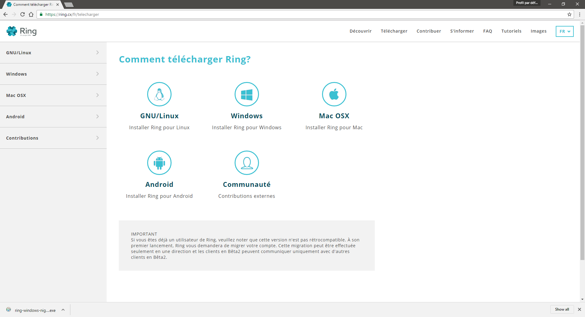
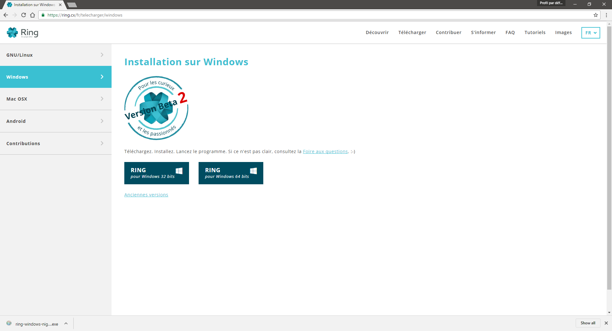
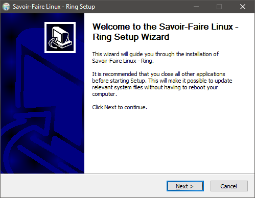
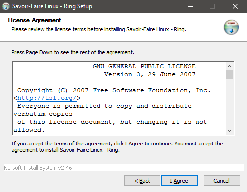
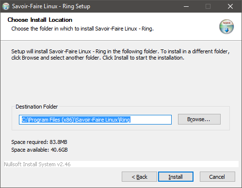
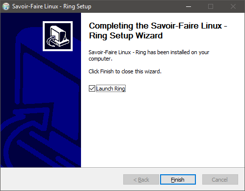
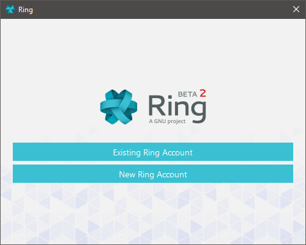

Documentation de l'installation sur Windows
=================================================

Afin d'installer Ring pour Windows, rendez-vous sur https://www.ring.cx/fr/telecharger et sélectionnez la plateforme Windows.

Par la suite, sélectionner votre système d’exploitation Windows. Une fois le fichier télécharger, ouvrez-le.

Une fois le fichier ouvert, cet assistant d’installation vous aidera à installer le logiciel. Sur cette fenêtre, appuyez sur « Next ».

Par la suite, afin de continuer l’installation, il est important de lire, de comprendre et d’accepter la licence. Pour continuer, cliquer sur « I Agree ».

Ensuite, veuillez choisir l’endroit où vous désirez installer le logiciel. Pour changer d’emplacement, veuillez entrer le dossier d'installation ou sélectionner « Browse ». Pour commencer l’installation, cliquer sur « Install ».

Une fois l’installation terminée, afin de lancer l’application, cocher la case « Launch Ring » et appuyer sur « Finish ».

Félicitation, l’application est installée ! 

