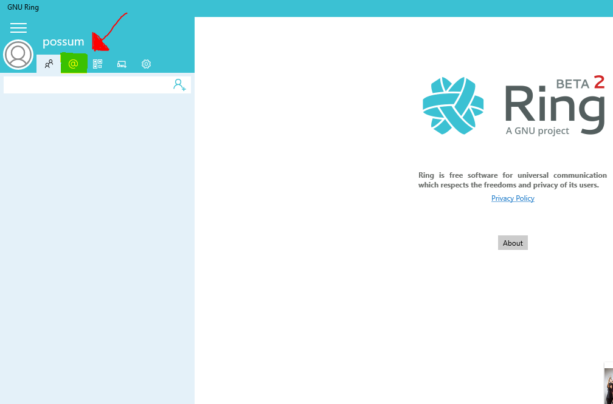
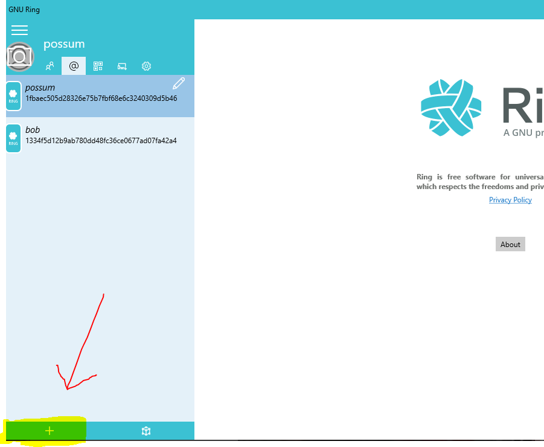
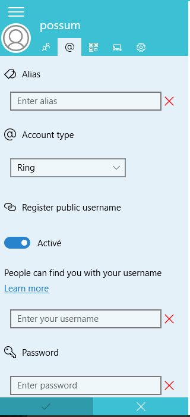
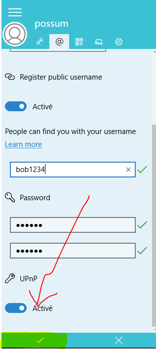
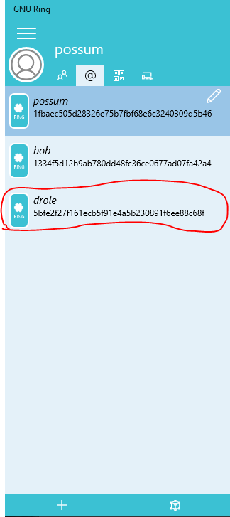

==============================================================
 Add a Ring account on GNU Ring on UWP (universal Windows Platform)
==============================================================

Add an Ring account to Ring
######################

- After starting the app and log in your account, click on the **@** Tab in the left corner of your screen. 

- From this tab, click ont the **+** in the bottom left corner.

- Fill the fields with your information. You don't need to modify the type of the account as it is set on Ring by default.

- When the fields are all filled, click on the **checked sign** located in the bottom left corner.

- If you have followed those step, your new account should showed up in the **@** tab.
