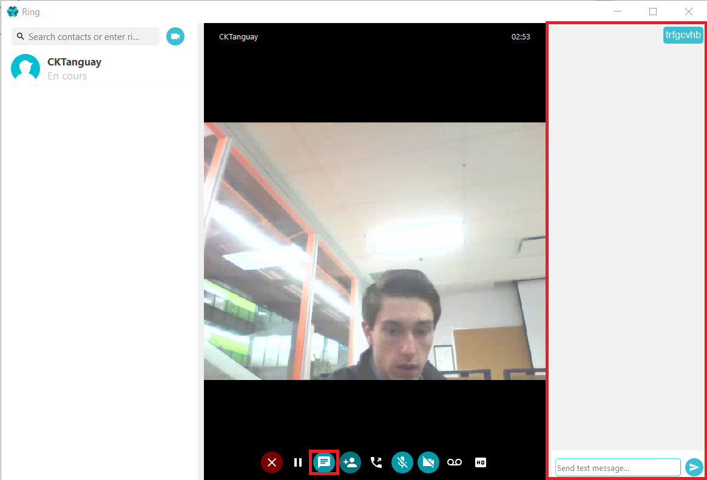
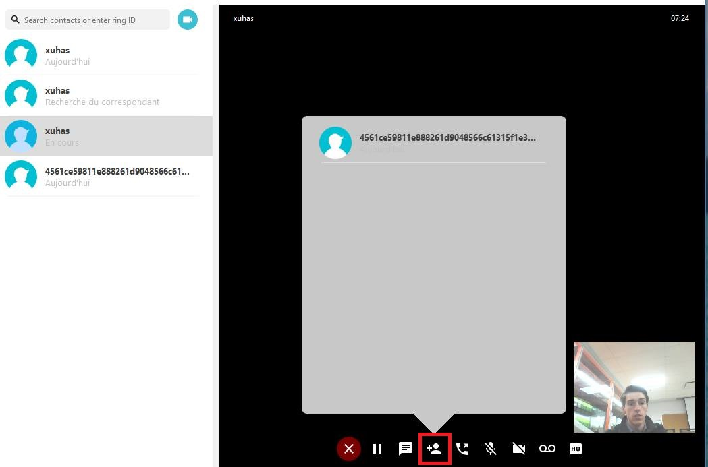
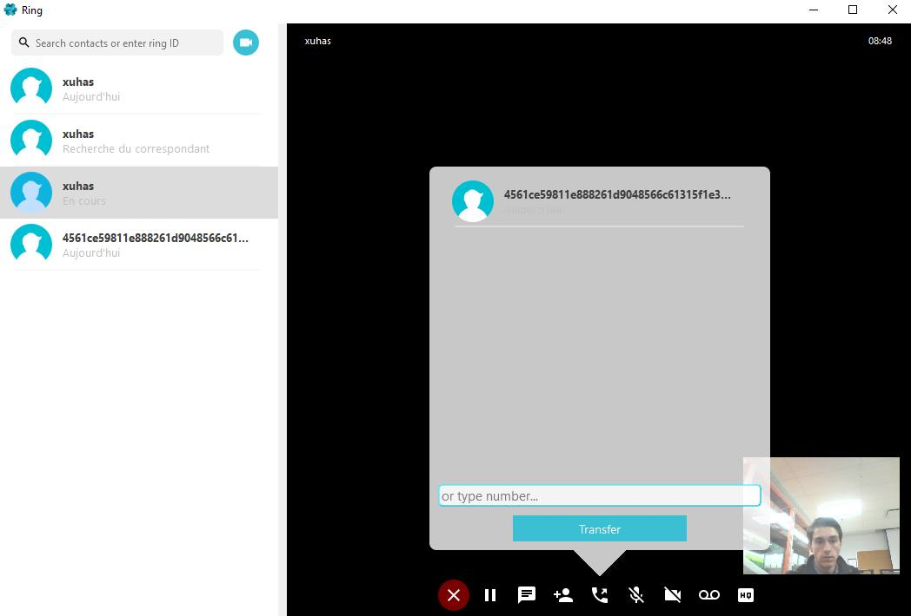
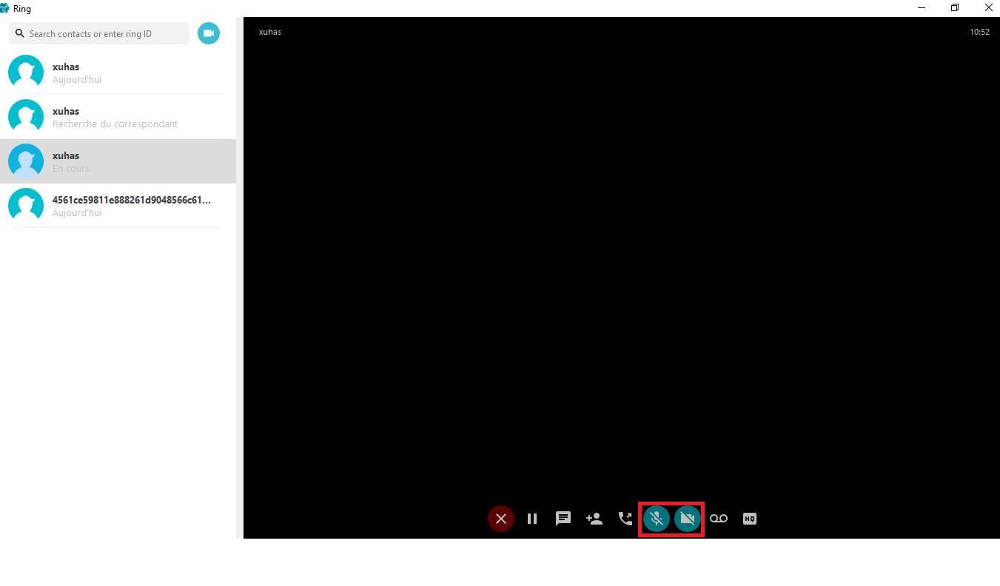
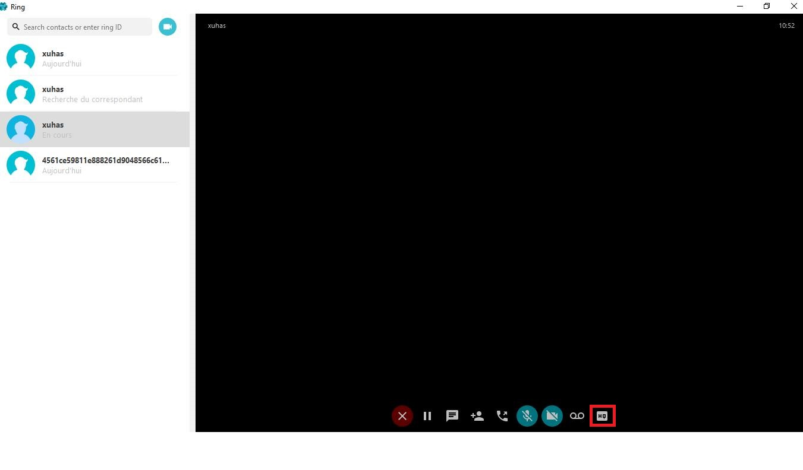

Documentation des étudiants "1828978", "1827066" et "1737944"
=====================================================

--------------
L'appel video sur Windows
--------------

L'appel video est l'une des fonctionnalités principales du logiciel de communication RING. Avec RING, il est possible d'avoir des conversations vidéos de façon sécurisée. Il suffit de partager votre RingID avec les personnes que vous voulez rejoindr ou d'obteenir le leur. L'autre utilisateur sera alors ajouté à vos contactes. Pour démarrer une conversation vidéo, il suffit de cliquer sur l'icone << caméra >>. 

Il est aussi possible d'inviter d'autres personnes dans vos conversations et ainsi faire des appels conférences. 

En cliquant l'icone de la messagerie texte, vous allez pouvoir faire appraitre un ruban qui permettera de chatter en écrit tout en continuant l'appel vidéo. 

Il est aussi possible de transférer l'appel courant à un autre contacte

Évidemment, vous pouvez interrompre le son ou la vidéo en tout temps et tout de même continuer l'appel par écrit.

Ring offre l'option d'augmenter ou de diminuer la qualité de l'image vidéo selon vos besoins et ceux de votre connexion.

