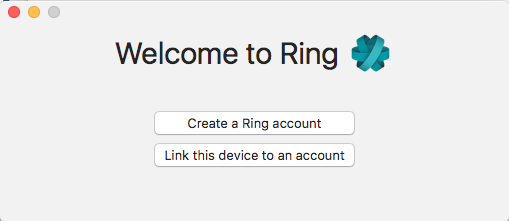
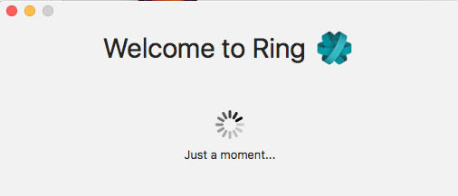
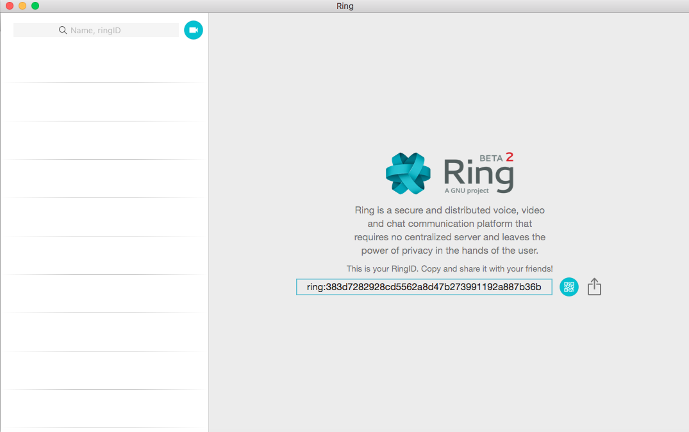

Création et configuration d'un compte Ring (Windows)
==============================================================
Cette documentation est à l'usage des nouveaux utilisateurs de Ring.

Téléchargement de Ring
--------------------------------

Rendez vous sur le site https://ring.cx/fr/telecharger/windows et téléchargez la version suportée par votre OS (32 ou 64 bits)

|image1|

Suivez les instructions de l'éditeur d'installation. Laissez les paramètres par défauts

|image2|

.. |image2| image:: 2.png

Vous pouvez après lancer Ring. 
Cliquez sur "New Ring Account".

|image3|

.. |image3| image:: 3.png

Configuration du compte
-------------------------------

Choisissez votre pseudo, votre mot de passe et renseignez les champs indiqués

|image4|

Vous avez à présent créé votre compte Ring ! Vous pouvez dès à présent échanger votre ID Ring avec vos amis afin de communiquer.
Si vous souhaitez modifier les paramètres de votre compte, cliquez sur l'icone de rouage en haut à droite.

|image5|

Modification des paramètres du compte
---------------------------------------

Si vous souhaitez modifier vos paramètres de profil, cliquez sur Account.

|image6|

.. |image6| image:: 6.png

Vous êtes à présent un utilisateur agueri de Ring !