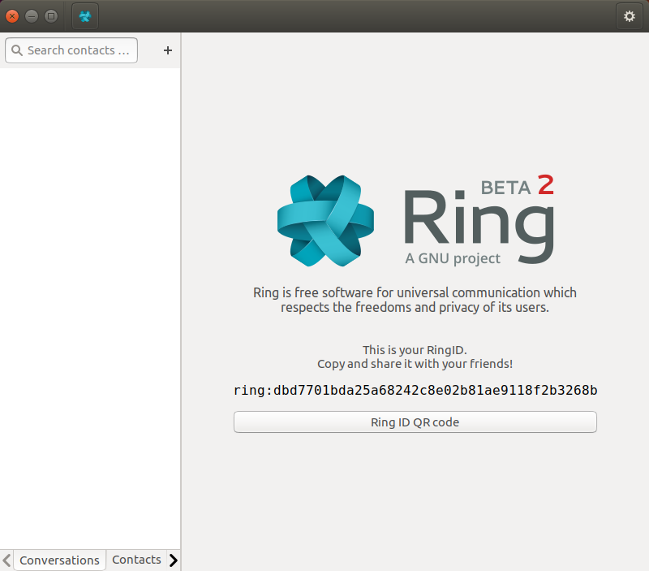
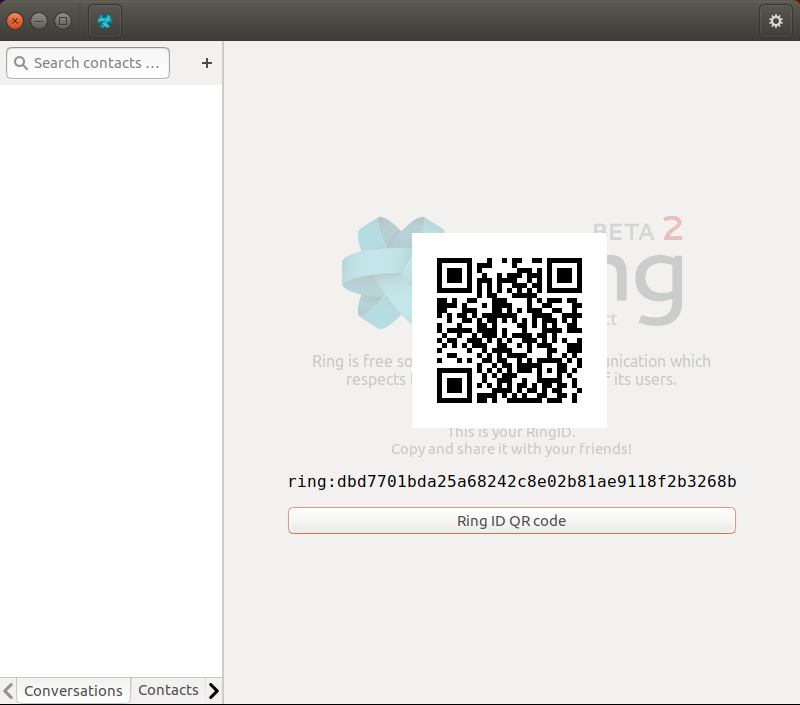

How to show a QR code
=====================

Instead of having a headache typing a long Ring ID, if your constact is using a phone and is next to you, you may simply want to scan a QR code. This is made easy by Ring, as you can show the code in two simple steps.

First, you will need to open the application.

From the home page, you can simply click on the "QR Code" button. This will show a QR code, as in the image below.

Your contact can now scan the QR code, and use it in place of a Ring ID to call you.

