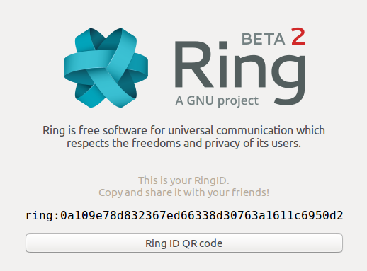
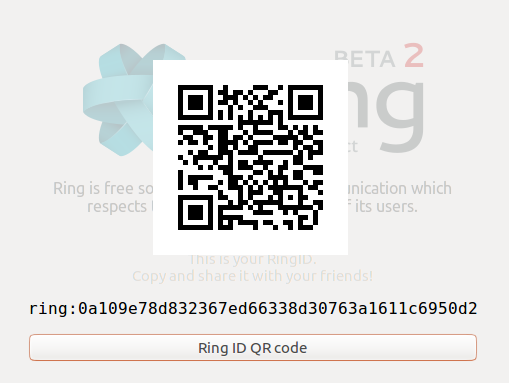

=======================================================
Sharing the QR code funtionnality for the GNOME Client
=======================================================
Share Ring ID using QR code.
-------------------------------------------------
*Purpose of the functionality*
The main purpose of the current functionality is to share the user Ring ID via a QR code (abbreviated from Quick Response Code). The QR code generated is a two-dimensional barcode that contains the user Ring ID. The scanned QR code allows a quick connection between two Ring applications (computer app and smartphone app).

*How to access the functionality from the computer app*

- Start the GNOME Ring application.

- The Ring ID is displayed on the application home screen.
- Click on “Ring ID QR code”

- The QR code appears on the computer screen and is ready to be scanned with the phone camera.

*How to access the functionality from the phone app*

- Go to “Home” to add a new contact.
- Click on the left-pointing magnifying glass symbol on the top right corner of the screen.
- The phone camera is ready to scan the QR code from the computer screen.
- The user allows the phone Ring app to access the phone camera.
- The Ring ID QR code is scanned and the contact is added and appears on the “Home” of the phone app.