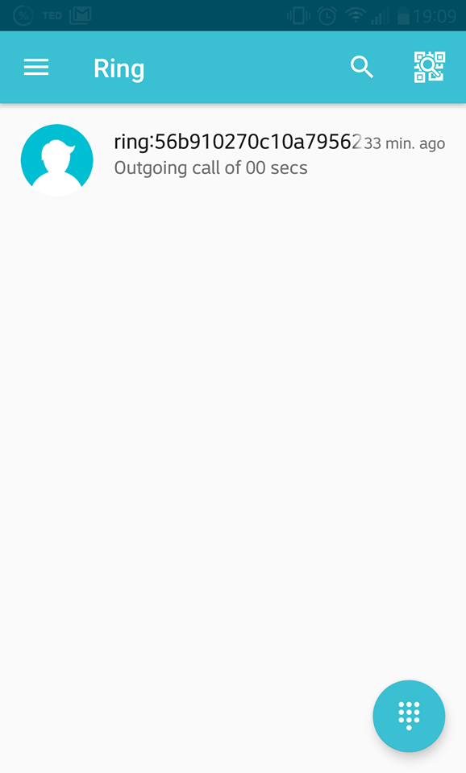
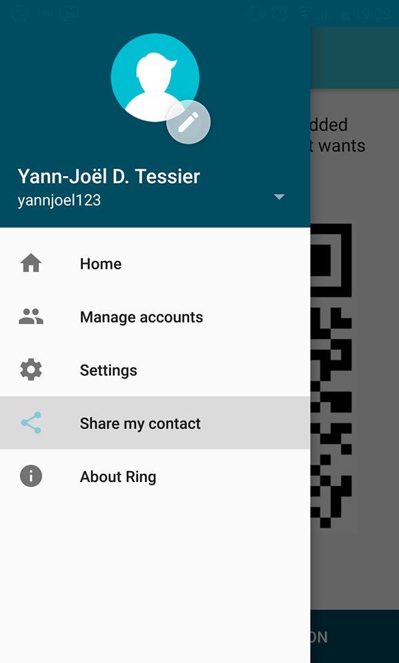
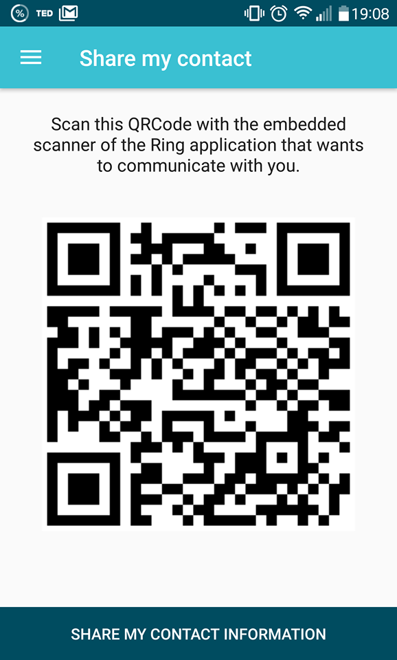

To display your QR code on Ring from an android device :
========================================================
A QR code is automatically generated for each account you create.

1. From Home, tap the 3 bars button on the screen’s top left hand corner.
2. A sidebar navigation menu will appear.
3. Choose Share my contact and you should see the QR code.

