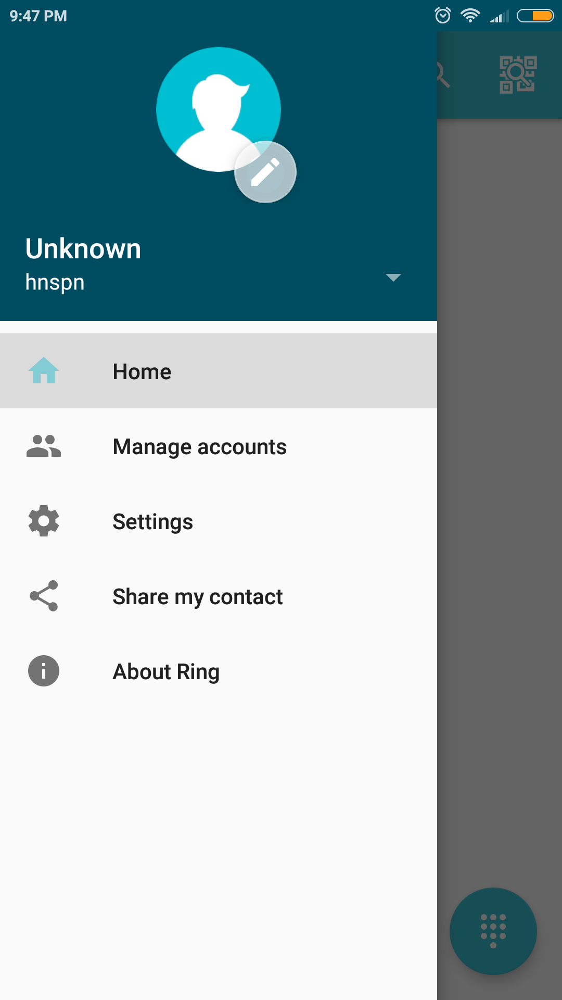
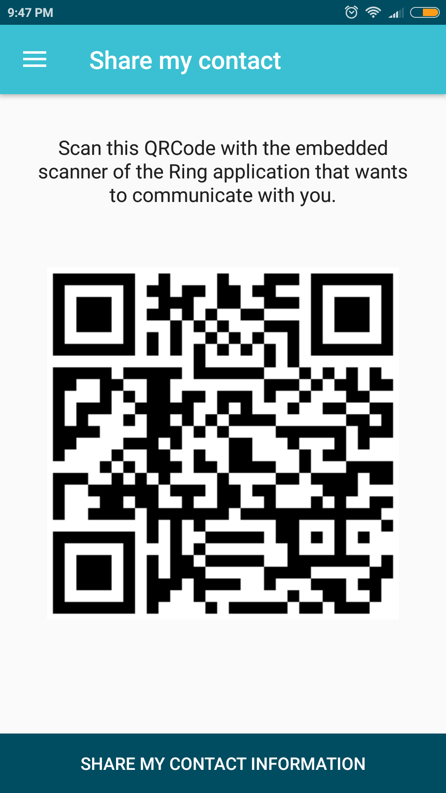

Documentation pour l'affichage du code QR
========================================================
But :
	Afficher le code QR peut etre tres utilse lorsqu'on un autre utilisateru de ring veut nous ajouter comme contact.
	En effet, il est souvent plus facile de montrer une image a quelqun qui est proche de nous que de lui eppeler notre nom d'utilisateur lettre par lettre.
	

Pour afficher le code QR associe au compte d'utilisateur, il faut utiliser l'option "Share my contact" a gauche de l'ecran.

On est alors transporter vers une page ou s'affiche notre code QR

Maintenant que vous avez votre code QR, une autre personne peut l'utilser pour vous ajouter avec la fonction "Ajouter un contact avec le code QR"

