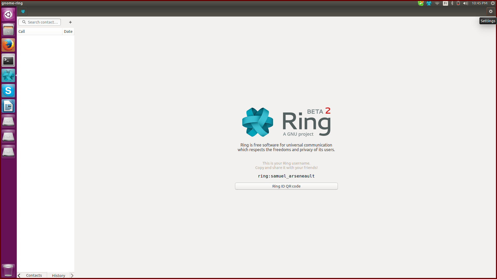
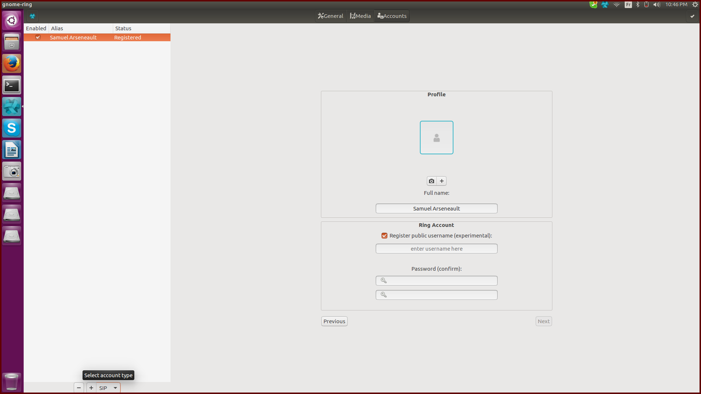
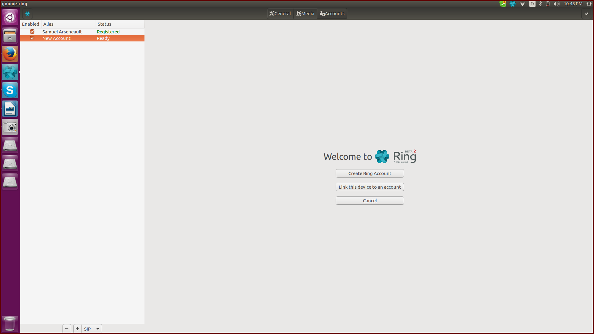

Création d'un compte SIP pour client GNOME
=======================

Après avoir ouvert Ring et s'être connecté, l'écran suivant apparaît:

Il faut tout d'abord cliquer sur l'icône d'engrenage se trouvant
en haut à droite de l'écran. Cela nous amène à la fenêtre suivante:

Ensuite, il faut sélectionner l’option SIP se trouvant dans un petit menu déroulant en bas à gauche de l’écran.
Il est possible que cette option apparaisse tout d’abord comme RING. Si tel est le cas, il faut la changer pour SIP.
Ensuite, il est nécessaire de cliquer sur l’icône + situé juste à côté.

Après avoir ajouté un compte en cliquant sur l’option +, il est possible de vérifier que celui ici a bien été
créé, car un nouveau compte est apparu dans la liste des comptes à gauche de l’écran.
Note: Ring ne demande pas à l’utilisateur d’entrer des informations pour ce compte;
celui-ci est créé avec des valeurs par défaut.
