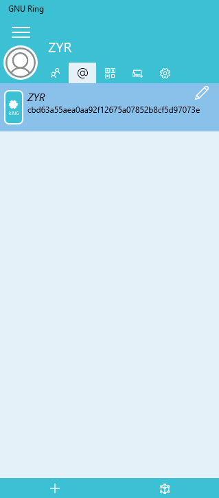
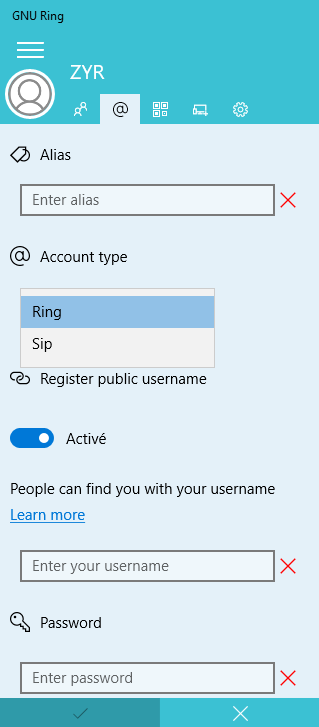
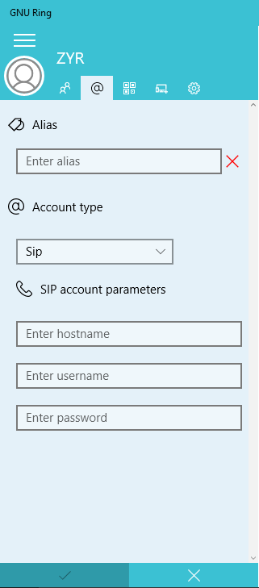

======================================================
Add a SIP account on Windows
======================================================

**Add a SIP account in 3 steps**

--------------------------------------------------

1. Click on the **menu button** |menu| at the top-left corner, then click on
|at|, the following window will appear: 

2. Click on the |plus| button at the bottom-left conrner. This will generate a new interface, where you are going to select your account type.

3. Select **Sip** under **Account type** tab, then you can enter your SIP account parameters. Click on 
|check| when you've finished and your SIP account will be added.

