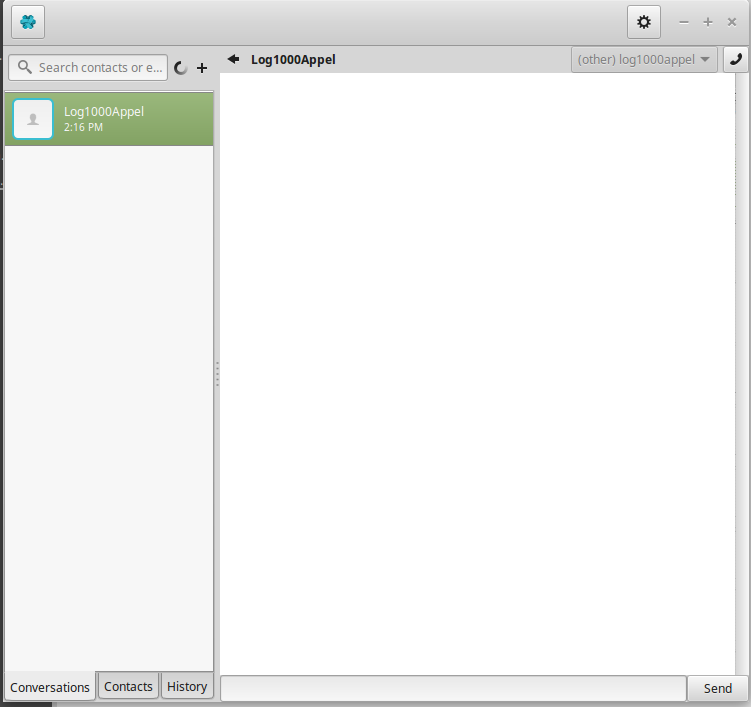

Make audio call
======================================================
In RING, it is possible to do some audio call. You will be able to talk to another RING user. If you are new to RING, this section will show you step-by-step how to start an audio call.

Step 1
---------------------------------------------------------
You need to have a contact in your contact list on the left in order to make a voice call. In the picture below, my contact is : Log1000Appel.

Step 2
---------------------------------------------------------
After you select the contact, you have to press on the phone icon on the upper right of the RING application.

Step 3
---------------------------------------------------------
You will obtain this screen. You can either hang-up or wait for the other user to answer your call

Step 4
---------------------------------------------------------
Once the other user answer, you will be able to view this screen.

Step 5
---------------------------------------------------------
During the call, you can move your mouse's pointer over the bottom of the window in order to see the options. Starting from the left, there is a key to end call, to hold the call, to mute the call, to mute the video,to record the audio,to adjust the video quality and to toggle the chat.

