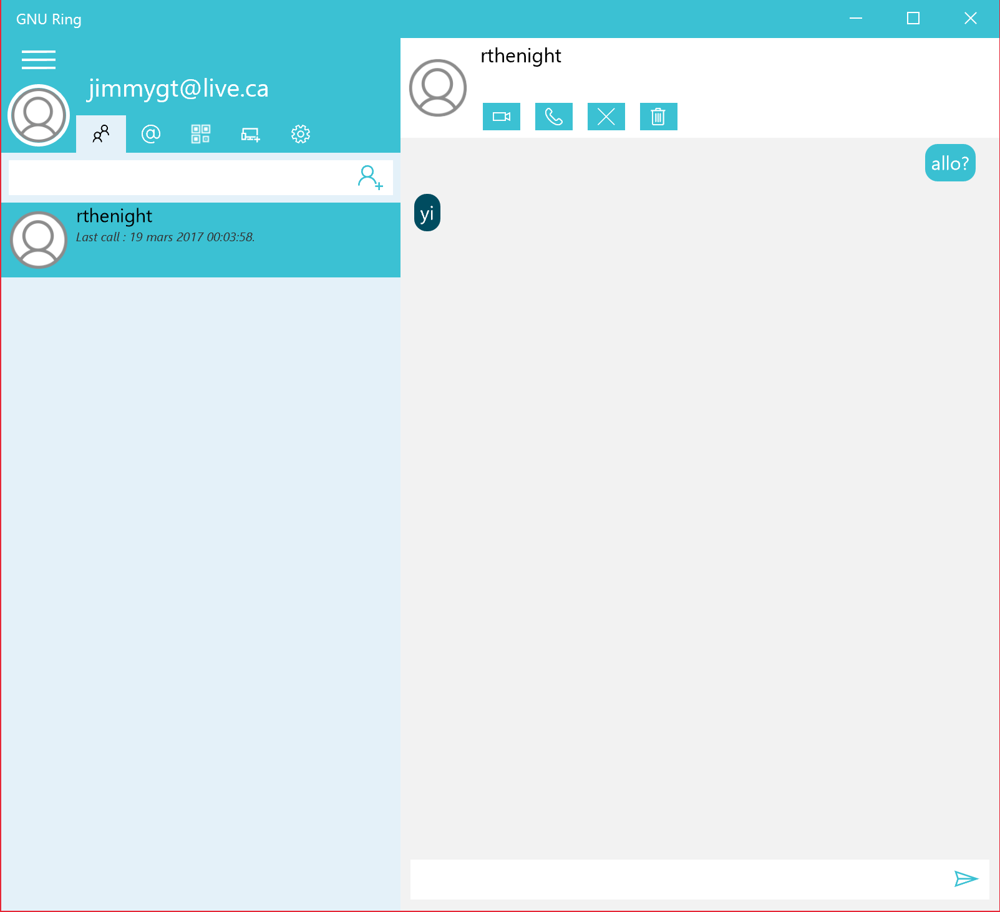

Make a call
=============================

**Ring allow you to call someone from your contact list**

First you need to add someone to your contact list. to do so, click on the first tab of the app and enter the name of the contact in the text box. Then, press enter
or click on the icon at the end of the box.

 .. image:: appel_audio_UWP/imageDepart.png

Then click on one of your contact. A conversation with this person will open on the right with different options at the top.

 .. image:: appel_audio_UWP/imageCliqueTelephone.png

Now to make a call with this contact, click on the phone icon. If the person accept your call, the page on the right will be replace by another one with all of the settings for the call. If you see this page, your are now talking to your contact.

 .. image:: appel_audio_UWP/imageConversationAudio.png

To end the call, click on the icon with the phone and the arrow at the bottom of the conversation. You can now see the last time of when you and this person spoke on ring below your contact's name.

