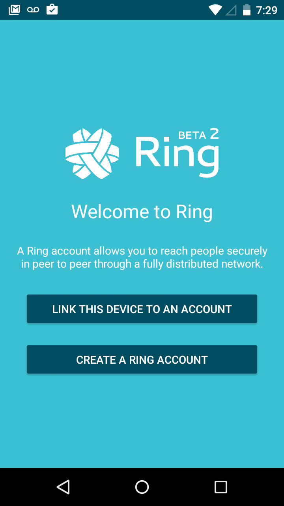
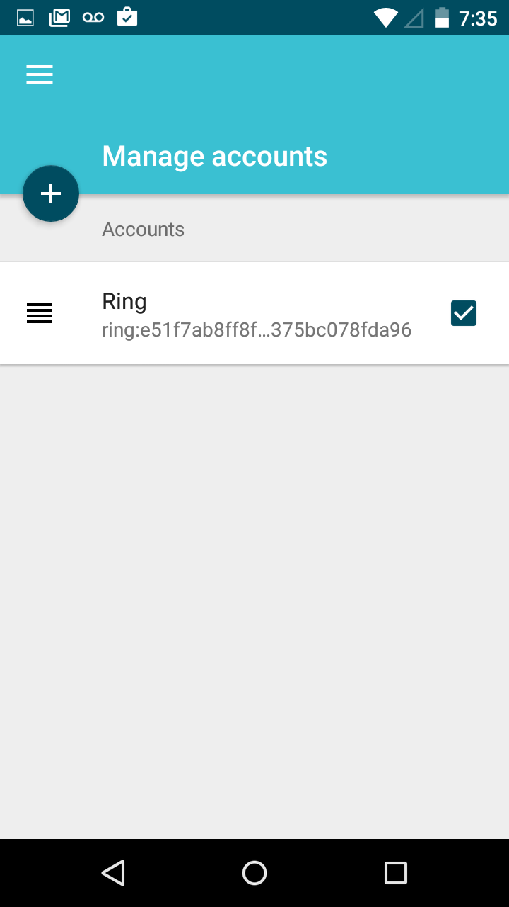

.. _appel_video_android:

Video calls
==========================

Once you have successfully :ref:`Downloaded and installed <downloading_and_installing>` Ring on your device,
you may connect your existing account or create a new one.

For Android clients
#######################

Making a video call
---------------------------
Once your account is linked, you have access to all Ring functionalities, including making video calls with other Ring contacts.

To make a video call from your android device, you just need to follow these next steps:

  1. Tap the menu icon located on the top left corner of your screen.

		.. image:: appel_video_android/menu.png
			:scale: 25 %
----------------------------

  2. Tap "Menu". You will find a list of your conersations with your contacts. If you have no conversations or your account is new, it will display "0 conversations".

		.. image:: appel_video_android/home.png
			 :scale: 25 %

  3. Use the search bar to find a contact by name.

	.. image:: appel_video_android/search.png
		 :scale: 25 %

  4. Tap the video camera icon next to the contact's name to start a video call with them.

	.. image:: appel_video_android/video_call.png
		 :scale: 25 %
 

Troubleshooting
###############

*This subsection is currently empty.*
