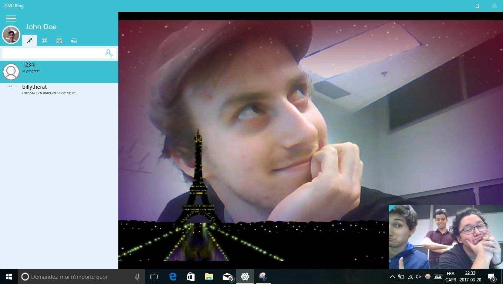

=====================================================
Make a video call on UWP (Universal Windows Platform)
=====================================================

Make a video call
#################

- From the app, hover over the name of a contact, a camera icon will appear. Click on this logo and the video call will start with the desired contact. You can also start a video call from an existing conversation by clicking on the camera icon at the top of the screen.

