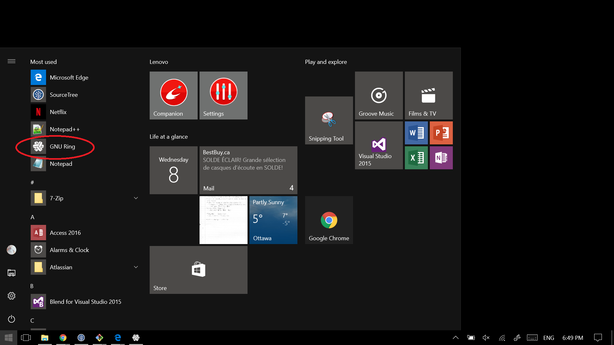

How to make a video call with Ring on Windows (English)
========================================================
You can make a video call to anyone on GNU Ring with anyone for free. Simple find your family, friends and colleague who are using GNU Ring and add them to your contact list. When you've added them, it is easy to make a video call as long one of you has a webcam.

Step 1
---------
Open GNU Ring by clicking the **start** button |startbutton| from your desktop.

Step 2
---------
In GNU Ring, click on your contact list.

Step 3
---------
Find the person you want to call from your contact list. If you have many contacts, you can type their name in the search box to find the contact you are looking for.

Step 4
---------
Click the contact.

Step 5
---------
Click the **Video call** button |videocallbutton| to make a video call.

Step 6
---------
Voilà, you are now in a video call with your contact!   

Step 7
---------
At the end of your call, click the **End call** button |endcall| to hang up.

Unanswered Calls
-----------------
If your call is not answered, the call will simply not start and hang up automatically.

