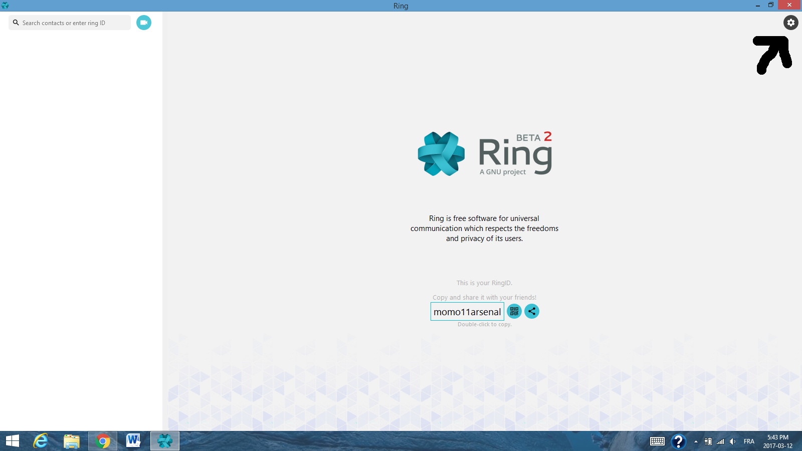
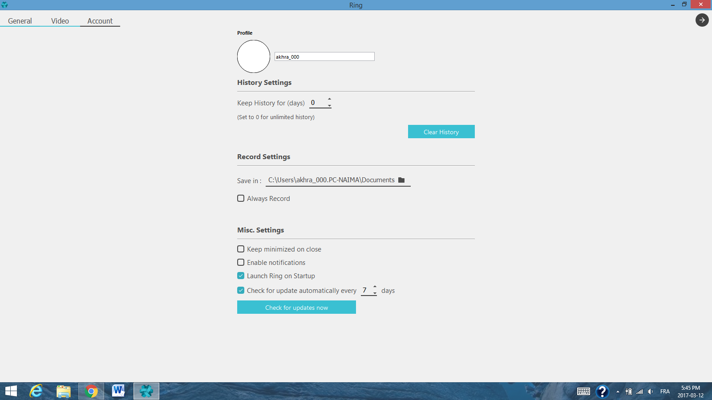
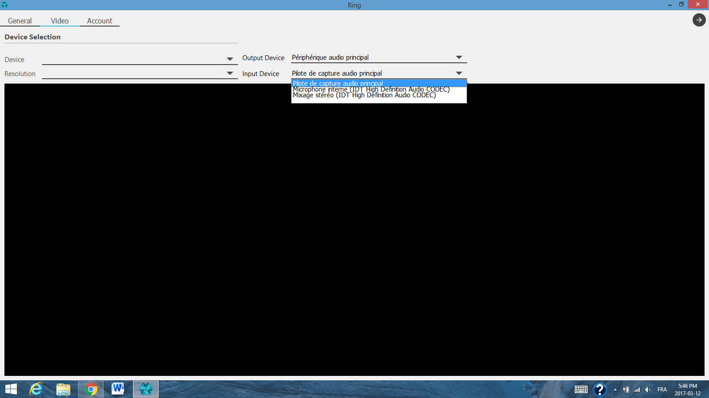
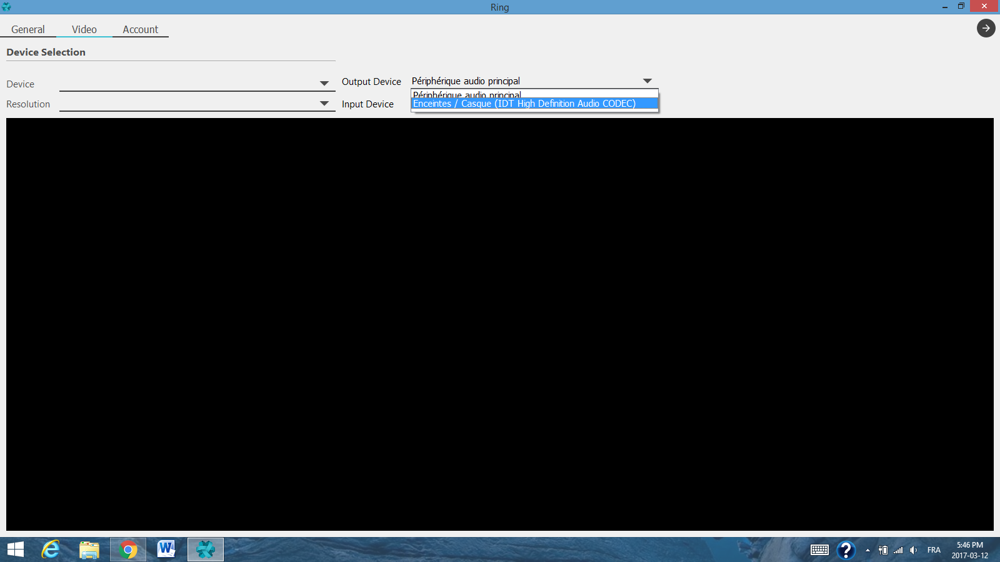

Configure audio on Windows Platform
=====================================
When you're inside Ring, you'll be able to configure your audio configuration. This section will allow you to do it.

Step 1 
-----------------------------------------------
You need to click on the setting section.

Step 2
-----------------------------------------------
In the settings section, click on the tab Video

Step 3
-----------------------------------------------
Change the input device to the desired one

Step 4
-----------------------------------------------
Change the output device to the desired one

