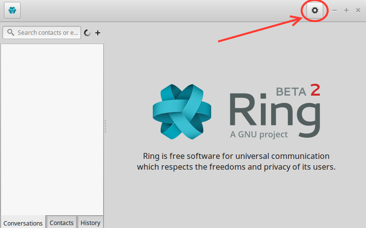
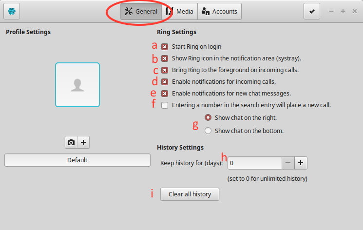

.. _configuration_general_gnome:
==========================
Configure Ring - General (GNOME)
==========================

1. Open Ring

2. Once open, click on the gear on the top left of the window as seen on Image 1

Image 1

3. Click on the general tab: the one circled in red in image 2.

Image 2

4. On this page , there are many available options :

a- Once checked, the ring software will start as soon as you log into your user.

b- Once checked, The icon to access ring will be available on the systeme tray wit hteh notifications.

c- Once checked, if you get a call, ring will force itself on the forground (in front of any other app).

d- Once checked, you will receive notifications when you receive on call on Ring.

e- Once checked, you will receive notifications when you receive a chat message on Ring.

f- Once checked, when you enter a number on the search bar, it will place a call to that number

g- If you check the top option , your chat will appear on the right of the app. If you check the second option, your chat will appear on the bottom of the app.

h- Enter the amount of days that Ring will keep your history on Ring. (Put 0 if you want you history never to be deleted).

i- Click this button to clear all your history on Ring.

