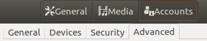
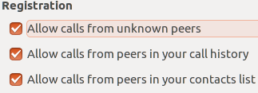
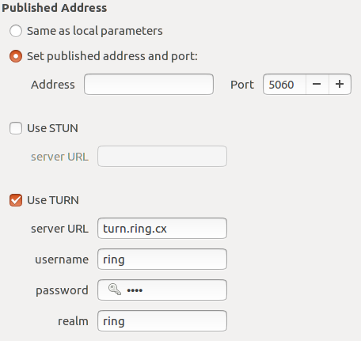
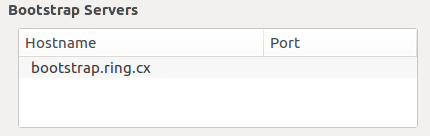
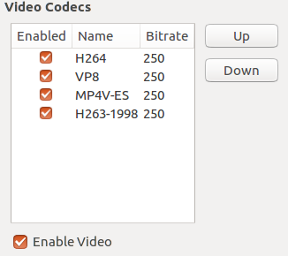
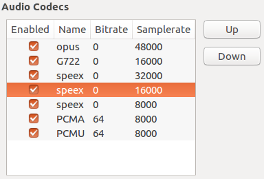

Configurer compte Advance sur GNOME
================================

Cette section nous permet de modifier les paramètres avancées des diférents comptes.

Afin d'avoir accès aux options avancées, il suffit d'appuyer sur le bouton d'options dans le coin suppérieur droit (engrenage). Ensuite, vous devez cliquer sur l'onglet suppérieur "Accounts" et enfin l'onglet "Advanced".

.. toctree::
    :caption: Registration
    :maxdepth: 1
    :glob:
    
Cette section s'agit d'une liste de cases à cocher selon vos préférences:

- Permettre les appels d'utilisateurs inconnus
- Permettre les appels des utilisateurs dans votre historique d'appel
- Permettre les appels des utilisateurs dans votre liste de contact

.. toctree::
    :caption: Published Address
    :maxdepth: 1
    :glob:

Permet de modifier l'addresse et de choisir la configuration du serveur utilisé. Il suffit de cocher les options voulues et d'entrer les informations dans les champs nécessaires.
    

.. toctree::
    :caption: Bootstrap Servers
    :maxdepth: 1
    :glob:
    
Cette section montre la liste de serveurs bootstrap

.. toctree::
    :caption: Video Codecs
    :maxdepth: 1
    :glob:
    
Cette section montre la liste des codecs vidéos et permet d'activer ou de désactiver ceux ci. Vous pouvez activer ou désactiver le vidéo dans cette section.

.. toctree::
    :caption: Audio Codecs
    :maxdepth: 1
    :glob:
    
Cette section montre la liste des codecs audios et permet d'activer ou de désactiver ceux ci

