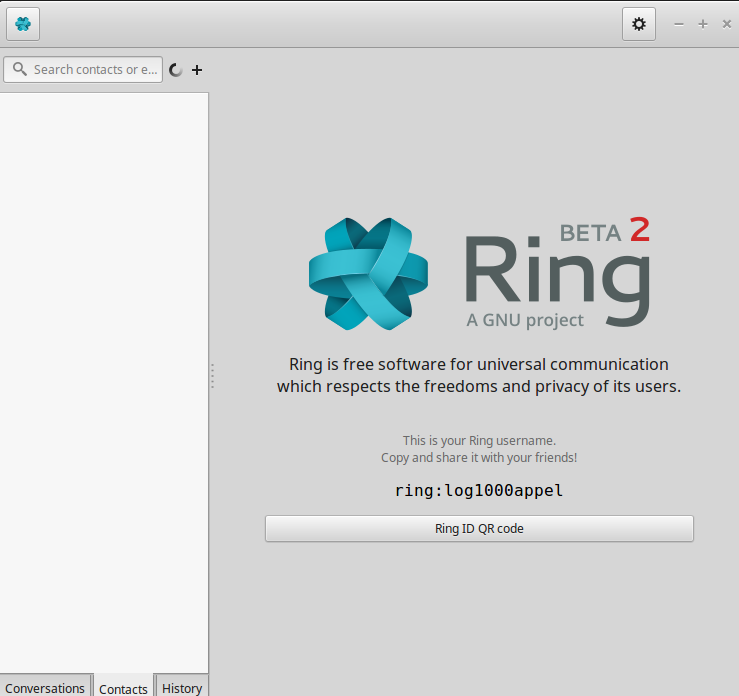
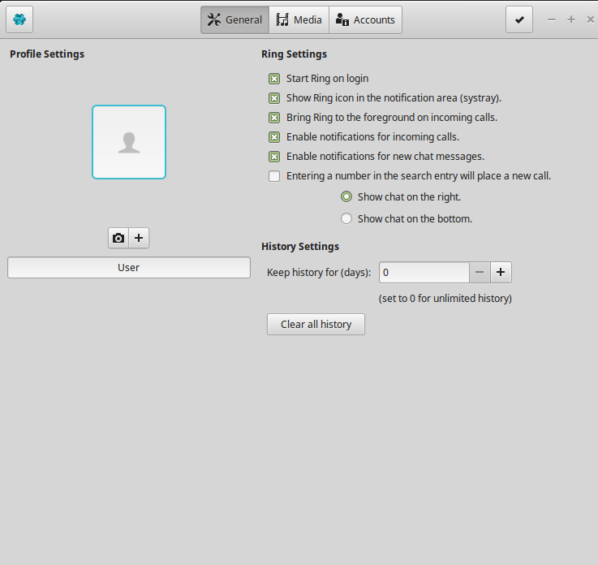
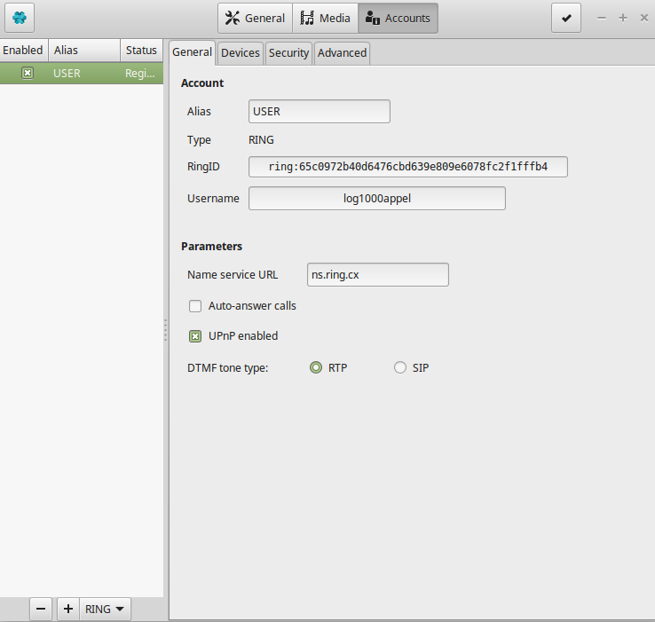
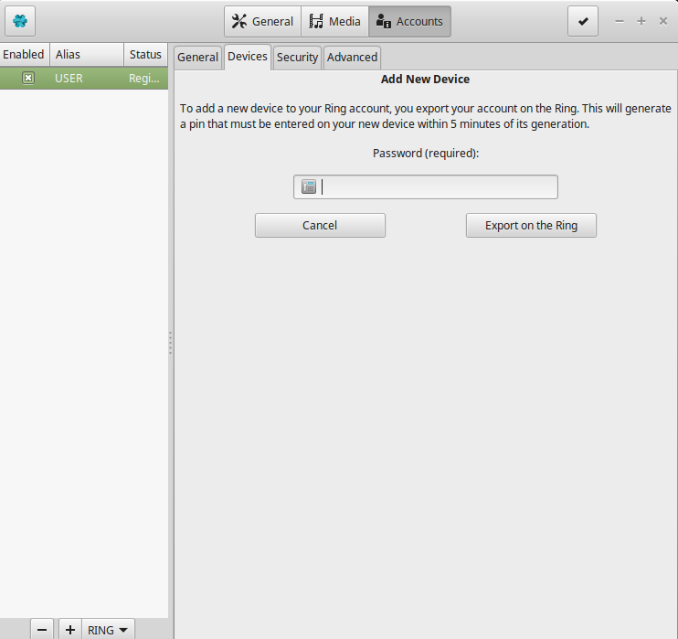
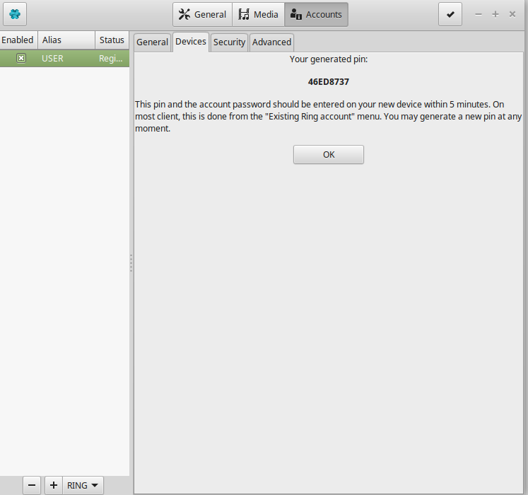

Configure account devices
========================================
You can open Ring on all your devices just by following the next steps that will be presented to you.

Step 1 
------------------------------------------------------------
Make sure you are signed in your Ring account. If you are signed-in you should be able to see this:

Step 2
-------------------------------------------------------------
Make sure to press on the following icon present in the top right corner of the Ring application

Press on this icon:

Step 3
-------------------------------------------------------------------
Now you should be able to see this on your screen.

Step 4
-------------------------------------------------------------------
Now that you are in the Settings, press on the Accounts icon.
You should see this:

Step 5
------------------------------------------------------------
Now that you are in the Accounts section, press on the Devices icon to have access to this:

.. image:: Configurer_compte_devices_GNOME/account.png

Step 6
-------------------------------------------------------------
Now you should be able to see all the devices where you are connected in your Ring account. 
If you want to allow a new device to have access to your account, press on the icon "Add device" on the bottom.
You should see this:

Step 7
-------------------------------------------------------------------------------------
Enter your Ring password in the allowed space, and then press "Export on the Ring".
After a few seconds, you will be able to see a pin that you will enter on the other device with your password within 5 minutes.

