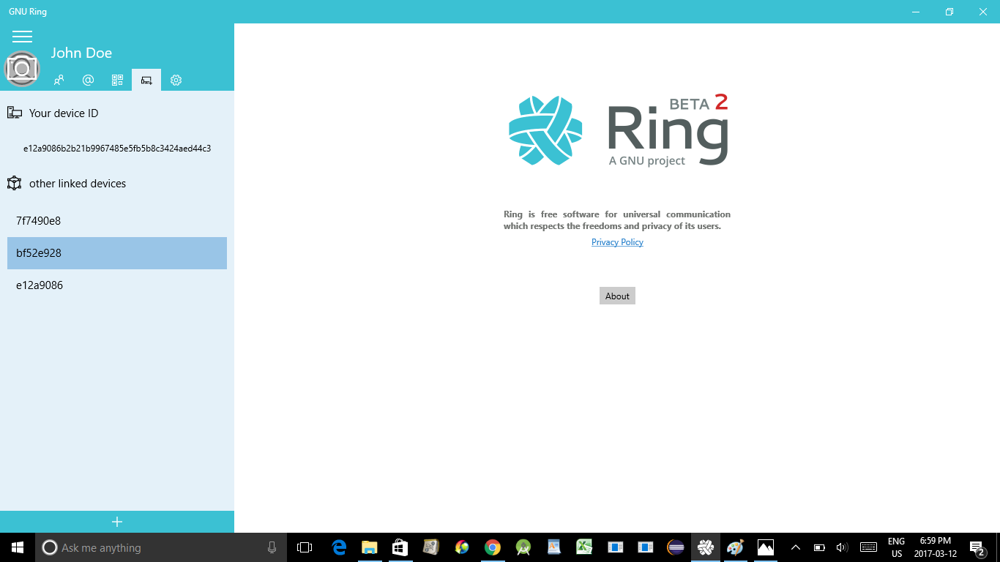

How to configurate devices on your Ring account (Windows)
======================================================================
This is how to configurate the devices on your Ring account:

Step 1
--------------
Once you have opened the GNU Ring application, go under the devices tab. Here you can see the ID of your device and all the devices that are linked to your account.

Step 2
---------------
In order to link this device to your Ring account, you will first need to generate a PIN. To generate a PIN, click on the button indicated in the picture and enter your password.

Step 3
---------------
Take note of the generated PIN and then go under the profile tab.

Step 4
---------------
Click on the button indicated in the picture and confirm that you would like to add this device to your account by selecting the checkmark at the bottom of the tab.

Step 5
---------------
Enter the PIN that you previously obtained and your password.

After a few moments, your new device should have been successfully added to your account!

