Configuring your Ring account media settings
============================================
The Ring account media settings allows you to adjust your Ringtone settings, your audio settings, and your video settings. In this section, we will show you how to find these media settings on your android phone, and how to change them to your liking.

Navigating to your Ring account media settings
----------------------------------------------

1. Open the navigation bar
##########################
Touch the button on the top left of Ring to open up the navigation bar

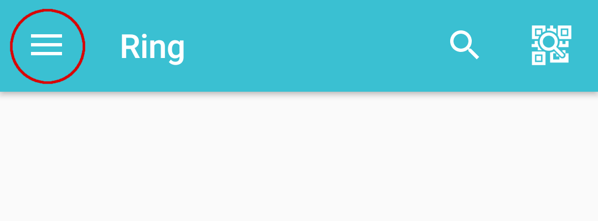

2. Go to "Manage accounts"
##########################
Touch "Manage accounts"

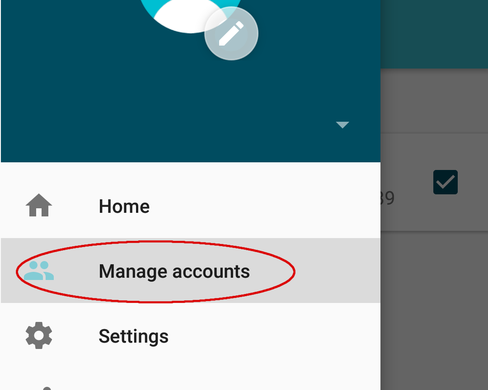

3. Choose your account
######################
Touch the Ring account for which you want to change its media settings

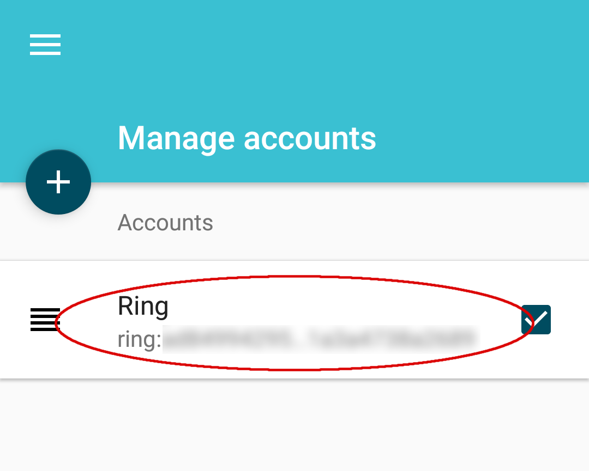

4. Go to your settings
######################
Touch the gear icon on the top right to open up your settings

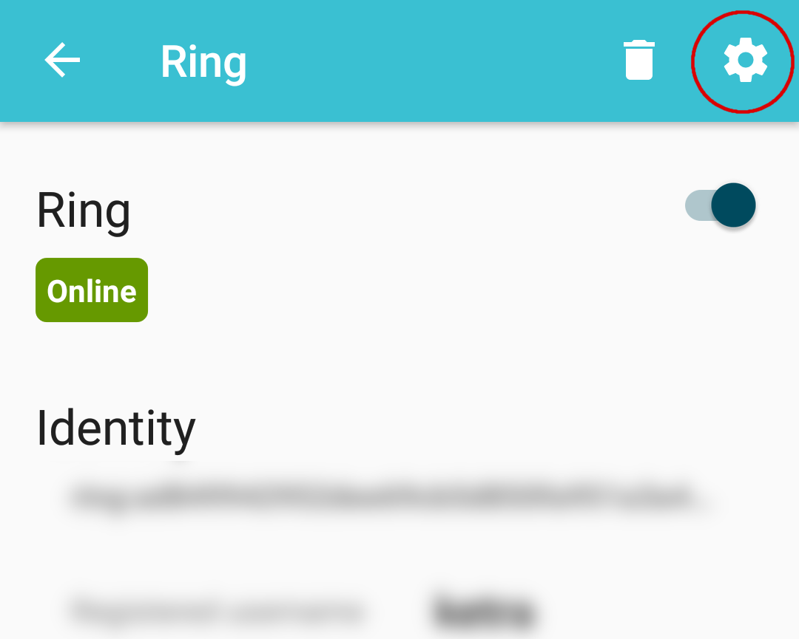

5. Open the media tab
#####################
Touch the MEDIA tab to open up your media settings

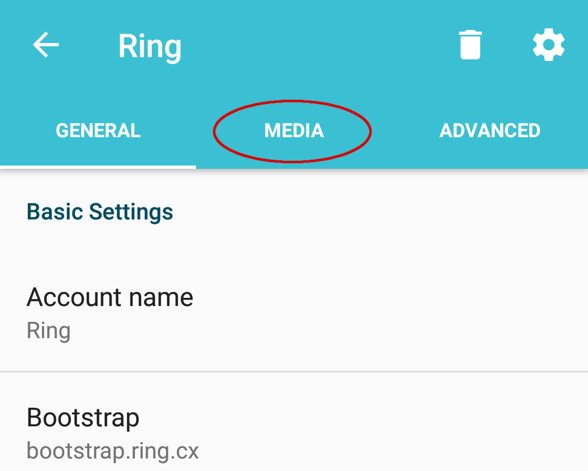

|
|
|
|

Ringtones
---------
Enable/Disable Ringtones
########################
Simply toggle on/off the setting "Activate ringtones"

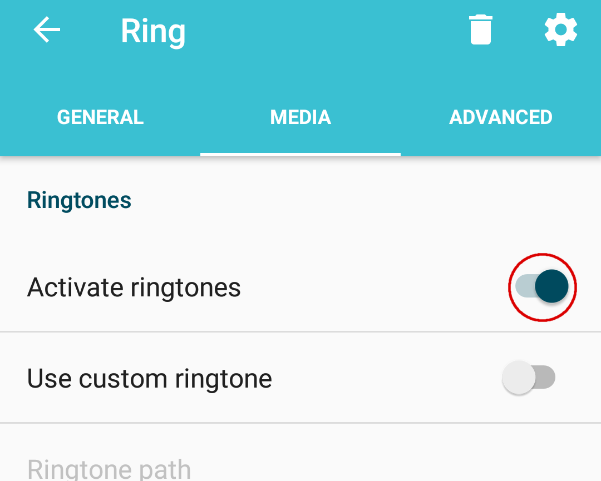

Custom Ringtones
################
Enabling custom ringtones :
	Toggle on the setting "Use custom ringtone"

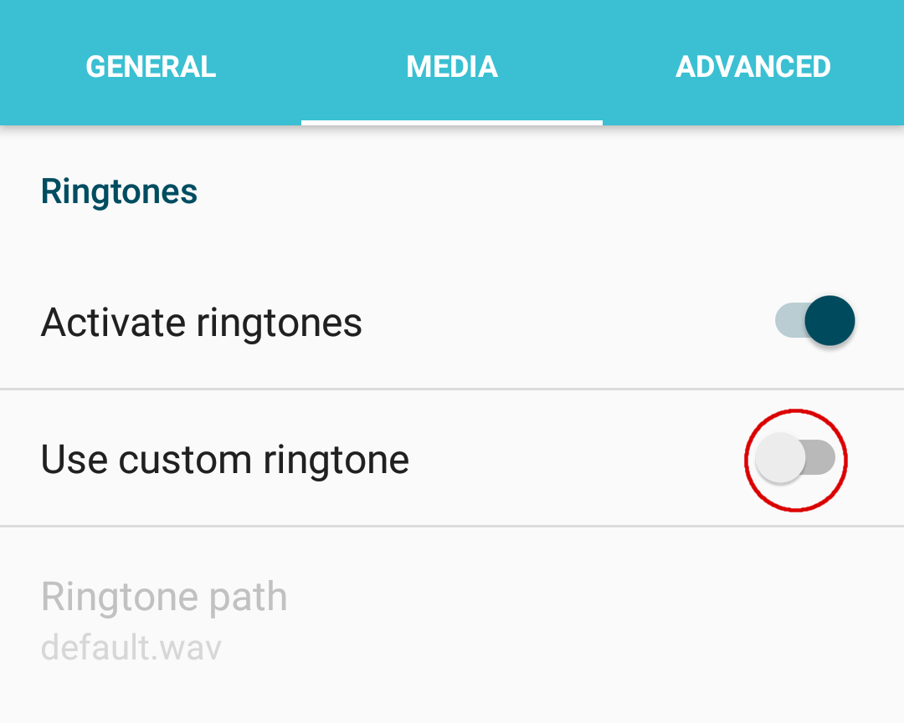

Choosing your custom ringtone :
	Touch the Ringtone path and navigate to the ringtone you want

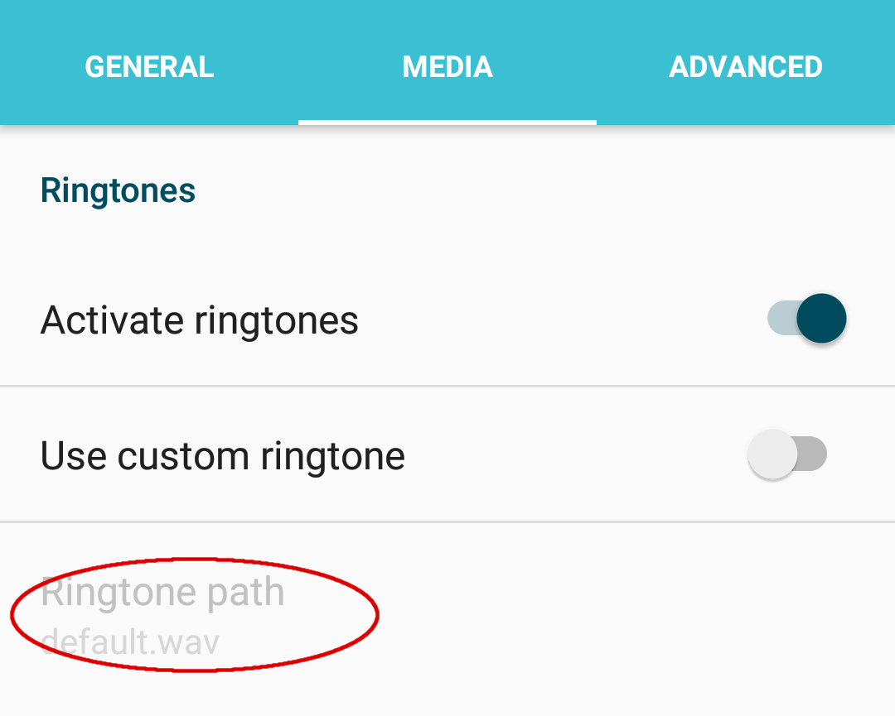

Audio
-----
Choosing audio codecs
#####################
Check the audio codecs on your device that you would like to use from the list.
Uncheck the unwanted audio codecs.

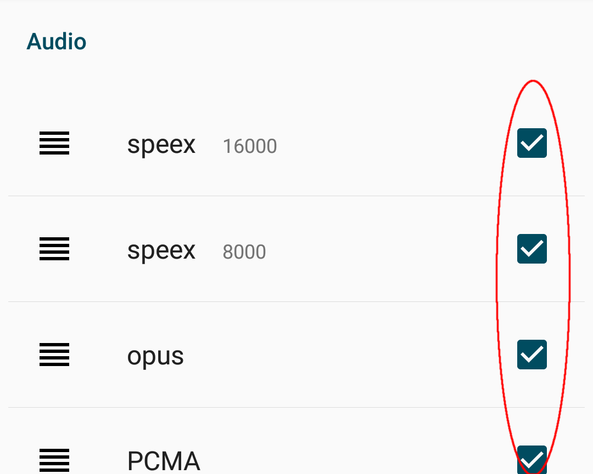

Video
-----
Enabling Video
##############
Touch the setting "Enable Video" to toggle on/off the setting

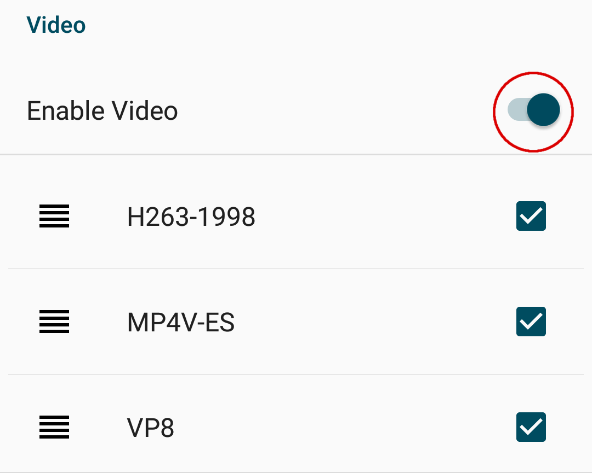
 
Choosing video codecs
#####################
Check the video codecs on your device that you would like to use from the list.
Uncheck the unwanted video codecs.

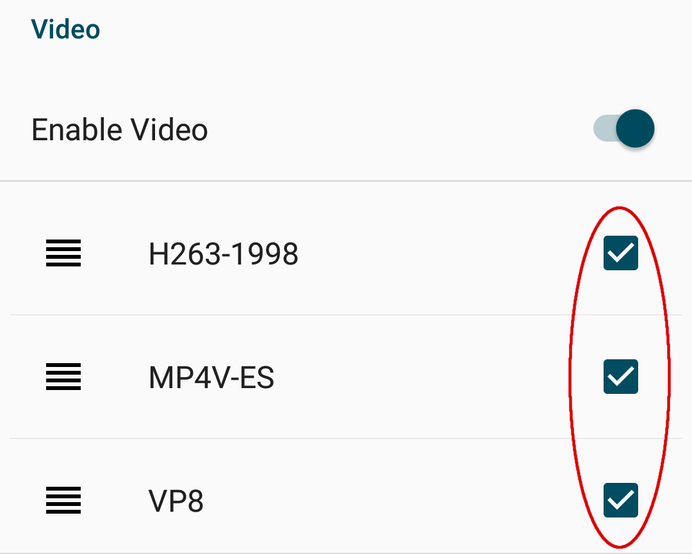

