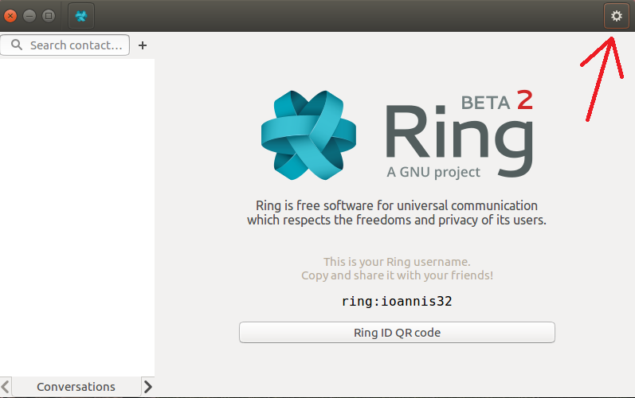
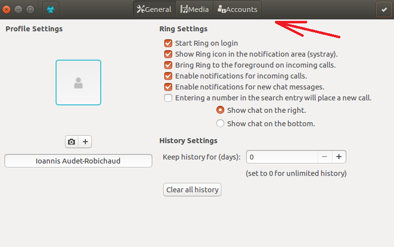
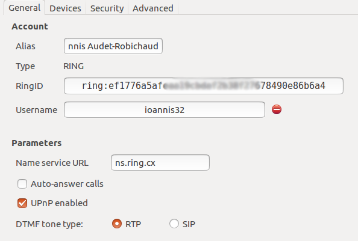
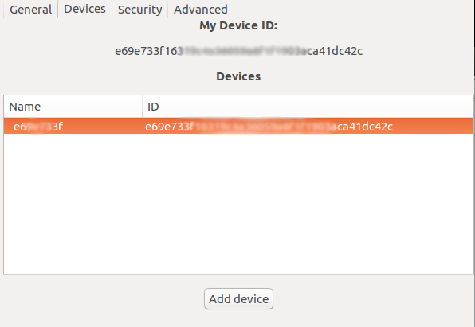
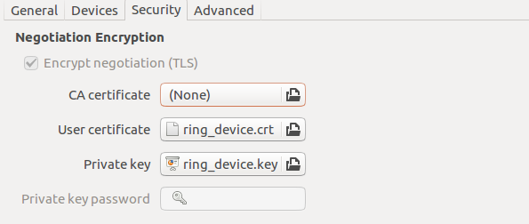
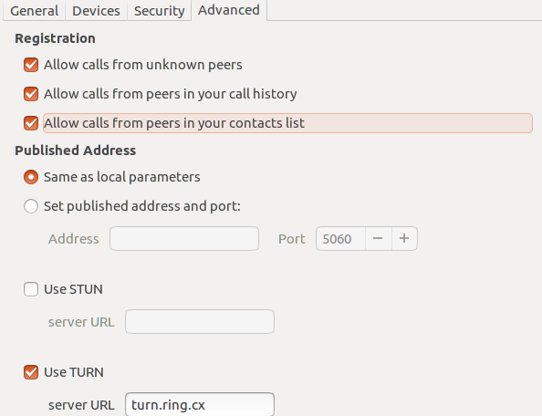
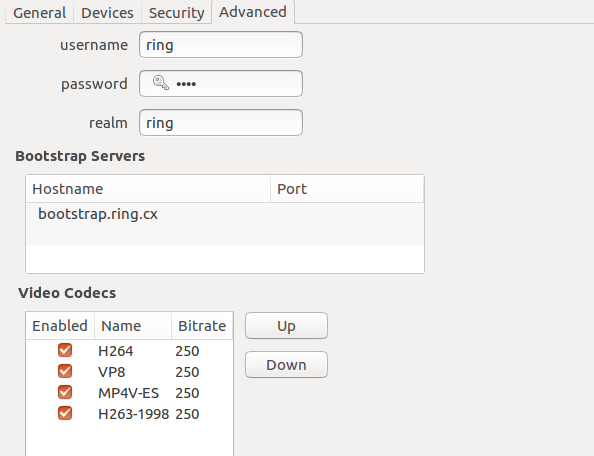
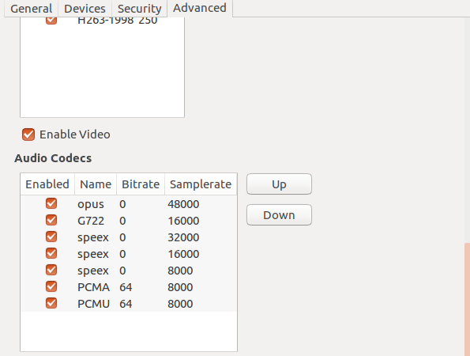

.. _configurer_compte_ring_GNOME:

Ring account settings 
=====================

To configure your Ring account, you must first click on the gear icon located in the top right corner.

Then, you must go to the "Accounts" tab.

Now, you are free to change your Alias and view your RingID, your account Type and your Username for each of your accounts. You can also change some other Parameters like your Name service URL. You may also choose whether or not you would like to enable Auto-answering calls and UPnP. Also, DTMF tone type is yours to decide (RTP or SIP).

Under the "Devices" tab you can manage the devices on which you want to use Ring.  

Moreover, if you click on the "Security" tab you can change various security settings. For example, you can upload
some certificates to identify yourself. 

Now, under the "Advanced" tab, you can decide from whom you are wishing to allow calls. You might also consider 
setting up your published address and port if you dont want them to be the same as your local parameters.

Finally, you can also change various server settings. 

