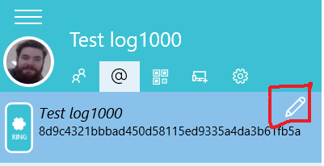
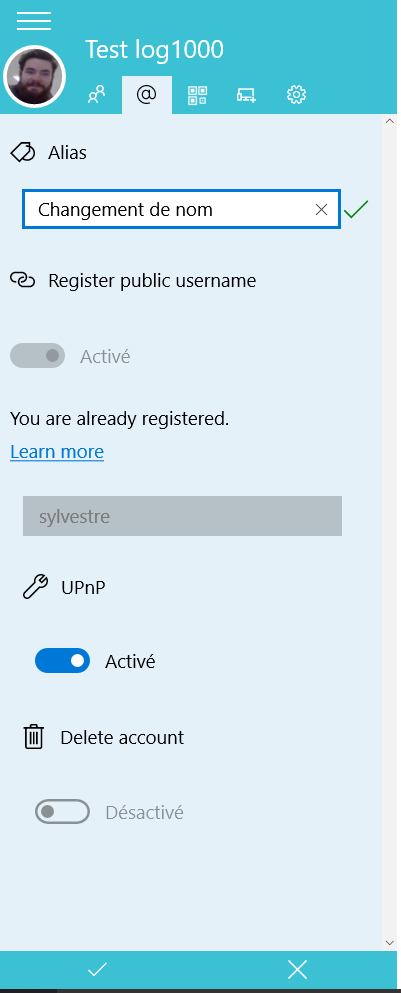
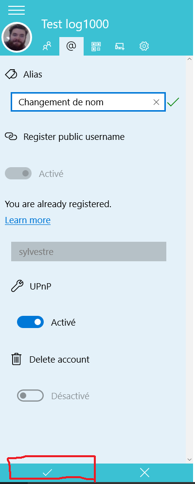

configurer compte ring UWP
==========================

Après le téléchargement ainsi que l'installation réussie du logiciel Ring vient l'étape de la création d'un profil d'utilisateur. Toutefois, il est possible de vouloir, et de pouvoir, modifier certaines informations entrées initialement lors de la création d'un profil. 

Dans ce guide, nous vous guiderons pas à pas pour la configuration d'un compte ring suite à l'installation de l'application `Ring <https://www.microsoft.com/fr-ca/store/p/gnu-ring/9nblggh43d70>`_ provenant du Windows Store.

1. Onglet Profil
################

En premier lieu, il faut sélectionner l'onglet profil, qui est situé en haut à gauche de l'écran, tel qu'illustré sur l'image ci-dessous:

2. Modifier Profil
##################

En second lieu, il faut sélectionner l'icône de petit crayon pour accéder à la fenêtre de configuration du compte ring, tel qu'illustré sur l'image suivante:

3. Procéder aux changements
###########################

En tiers lieu, c'est maintenant temps de procéder aux changements d'informations que vous désiriez apporter. Le changement que nous avons ici apporté est à l'alias de l'utilisateur, nous avons passé de "test log1000" à "changement de nom", tel qu'on peut voir dans cette image:

4. Confirmer les changements
############################

En dernier lieu, il faut sélectionner l'icône de crochet tout en bas à gauche de l'écran, tel que mit en lumière sur cette image:

Et voila, votre profil a été configuré!

