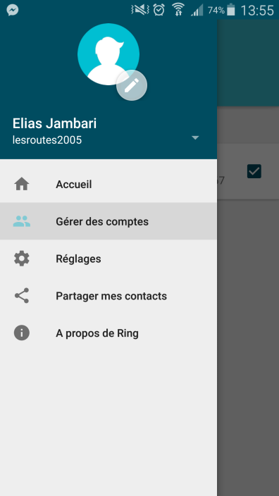
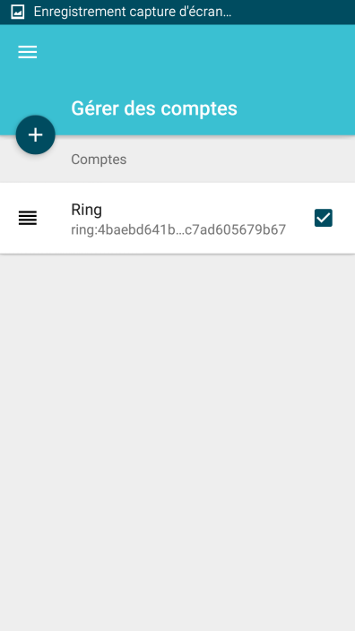
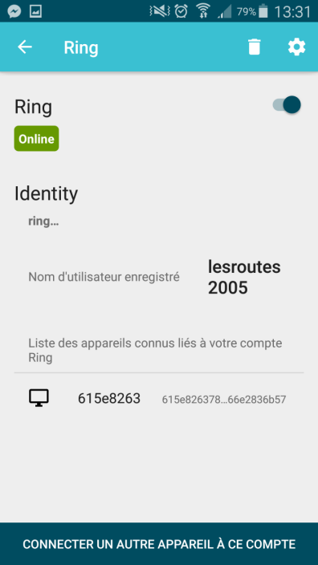

========================================================
Configuring your Ring account on your Android device
========================================================
Getting to the menu
--------
You can get to the configuration menu by following these steps :

1. Select **Manage Accounts** in the left sidebar by swiping right from the left side of the screen (or by hitting the button on top-left corner of the screen).

2. Then you can choose to **add an account** by selecting the "+" button or you can choose to **manage an existing account** by selecting the desired account in the list.

--------
Configuring your account
--------
When accessing this menu, you can do the following actions :

- **Delete your account** (a popup modal will ask you to confirm your choice)
- **Manage settings** related to your **device, medias or advanced settings**
- **Change the status** of your account **(Online/Offline)**
- **See your username**
- **See all devices** that are connected to **your Ring account**
- **Add a new device** to your account

Note : If you choose to add a device, a PIN number will be provided to you. You will have 10 minutes to enter it on your new device to link it to your account.

:Authors:
    Elias Jambari,
    Hugo Tremblay

:Version: 1.0 of 2016/03/12
