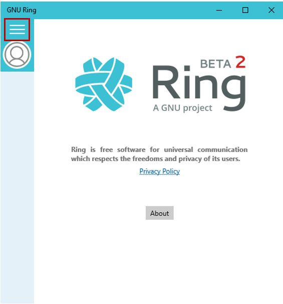
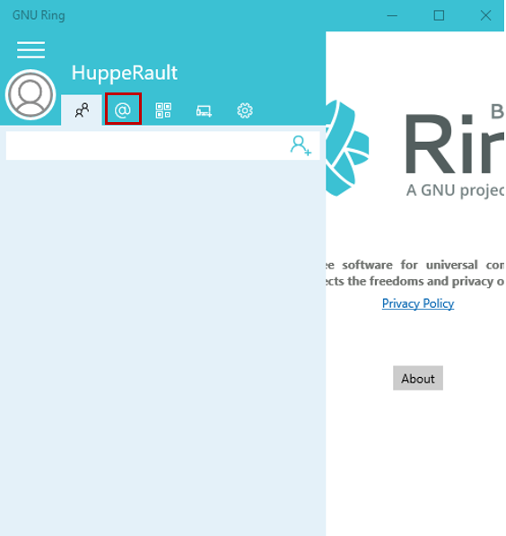
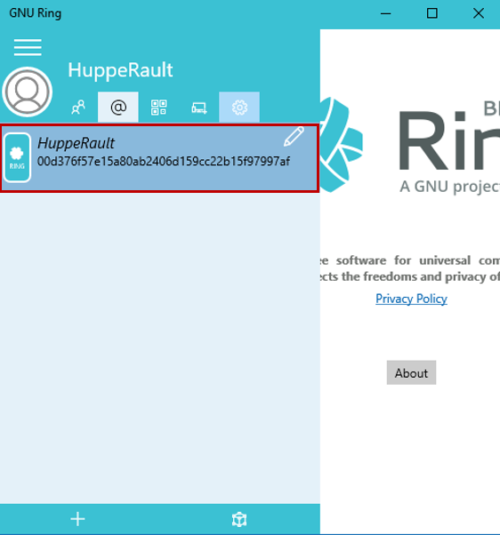
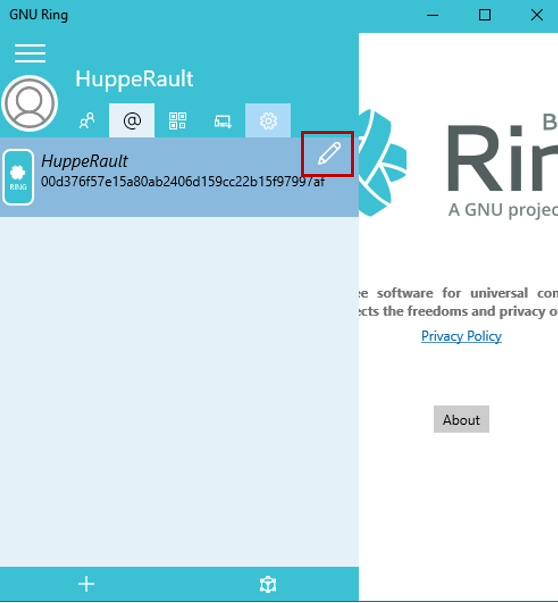
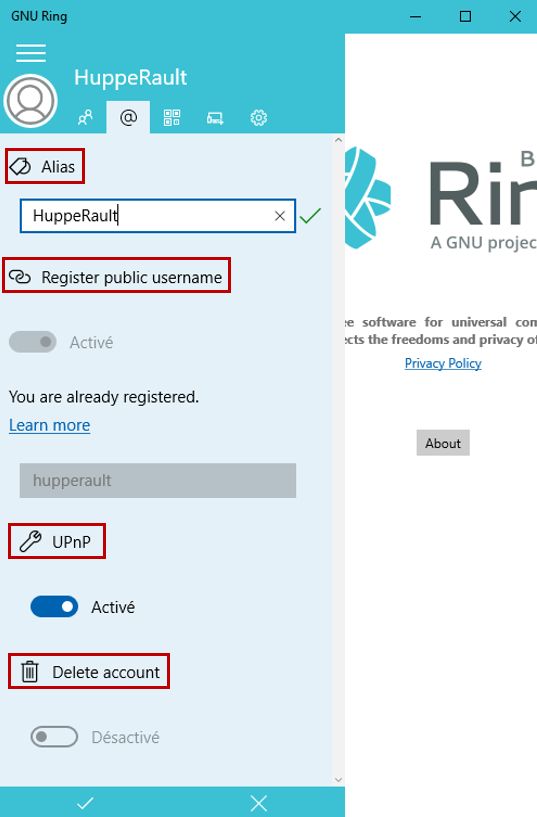
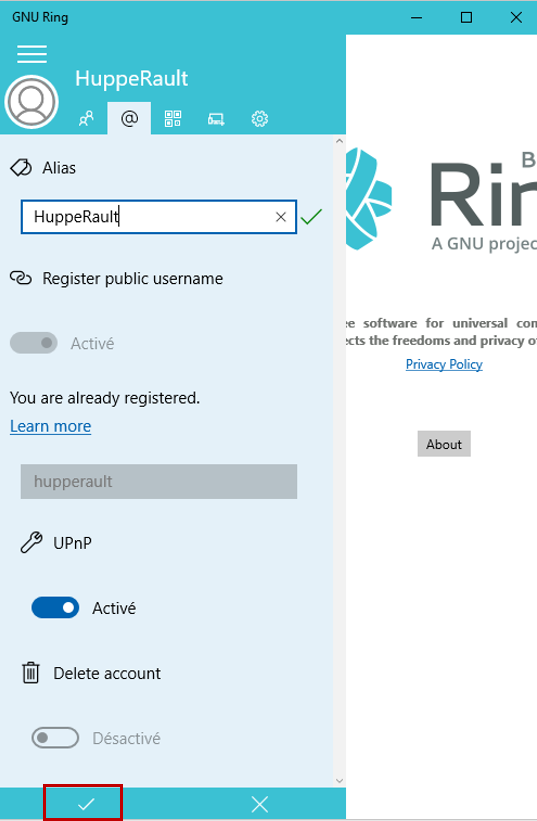

======================================
Configuring Ring account on Windows
======================================

Configuring your Ring account allows you to personalize some settings.

In order to configure your Ring account, you need to make sure you are connected.

1. Accesssing Ring menu
######################

To access Ring menu, you need to click on the menu icon in the left upper corner.

2. Accesssing Ring tab
##############

To access Ring tab you need to click on the @ symbol in the menu bar.

3. Selecting the account
########################

Select the account you want to make some changes by clicking on it.

4. Accessing the settings menu
##############################

To access the settings menu, you need to click on the pen symbol in the upper right corner of your selected account.

5. Configuring Ring account
###########################

You can now configure your Ring account. 

A summary of the settings options is shown below.

+------------------------------+---------------------------+-------------------------+
| Section                      | How to change it          | Descripion              |
+==============================+===========================+=========================+
| **Alias**                    |  write new username       | Change your username    |
+------------------------------+---------------------------+-------------------------+
| **Register public username** |  activate/desactivate     |Make your username public|
+------------------------------+---------------------------+-------------------------+
| **UPnP**                     |  activate/desactivate     | Allow Ring to use UPnP  | 
+------------------------------+---------------------------+-------------------------+
| **Delete account**           |  activate/desactivate     | Delete this account     |
+------------------------------+---------------------------+-------------------------+

6. Confirm changes
##################

To save and confirm all the changes you have made you need to click on the check mark in the lower left corner.

