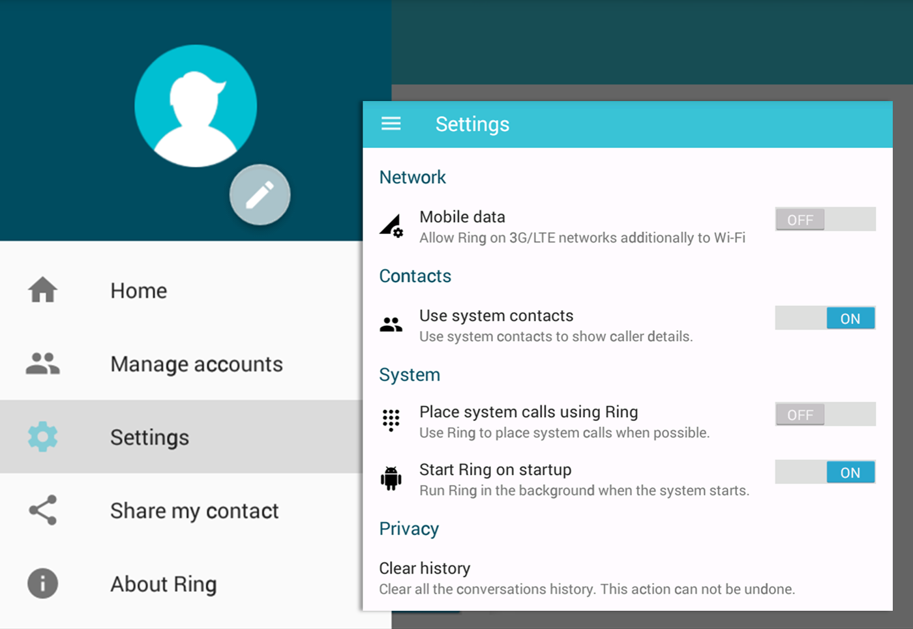
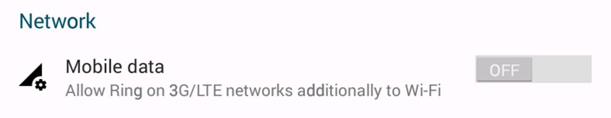
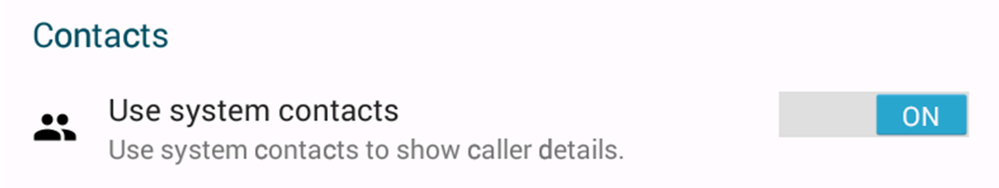
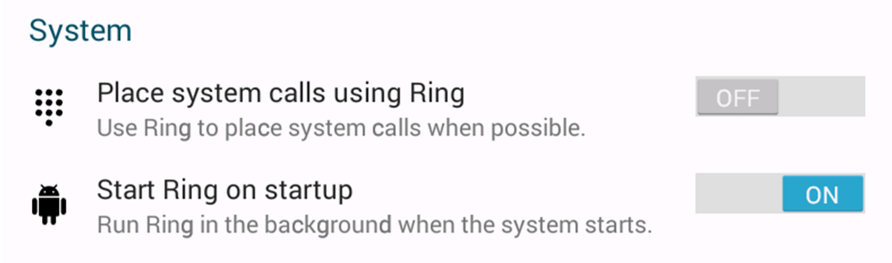

Android - General settings
=============================

Settings
#############################

The general settings menu allows users to control the basic settings for the software. You can access it by selecting the settings menu from the left navigation bar.

Network
-----------------------------
In the network section, you can allow Ring to use your provider's Internet connection when your wireless connection is not available or too slow.

Contact
-----------------------------
In the contact section, you can allow Ring to get information from your phone book to show caller details.

System
-----------------------------
In the system section, you can allow Ring to place system calls when possible. You can also start Ring on startup to run it in the background.

  	
  	
Privacy
-----------------------------
In the privacy section, you can clear all the conversation history.

