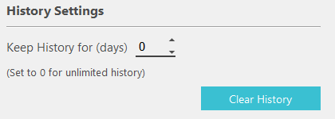
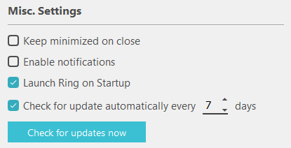
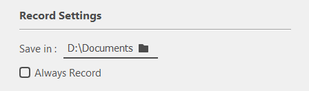

Documentation of functionality : configurer_general_windows
========================================================

=======
Profile
=======

Picture
	Allow to change your profile picture.
Name
	Allow to modify your username.

================
History settings
================

Keep History for (days)
	Allow to select the number of days for which the history is kept.
Clear History
	Button that, if pressed, history is immediatly cleared.

==============
Misc. settings
==============

Keep minimized on close
	Tickbox, if ticked, ring will minimized on close.
Enable notifications
	Tickbox, if ticked, notifications will be enabled.
Launch Ring on Startup
	Tickbox, if ticked, ring will launch on startup.
Check for updates automatically
	Tickbox, if ticked, ring will automatically check for update every "number of days given".

===============
Record Settings
===============

Save in
	Folder in which recordings will be saved.
Always record
	Tickbox, if ticked, ring will always record your calls.

