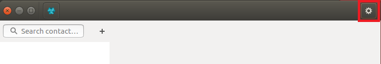
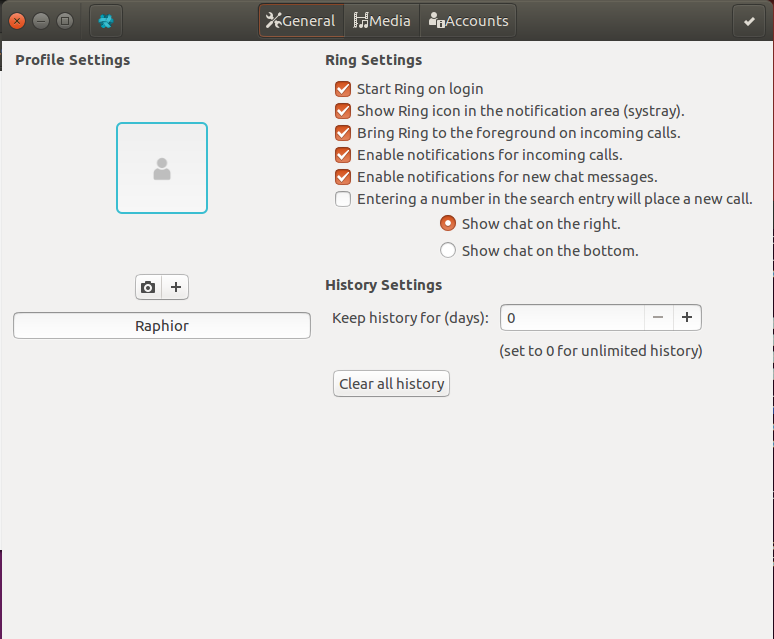
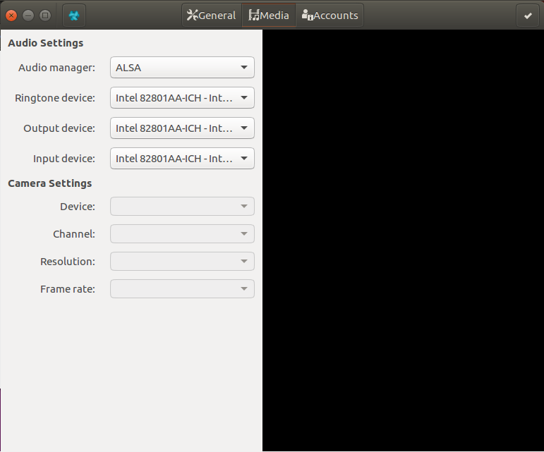
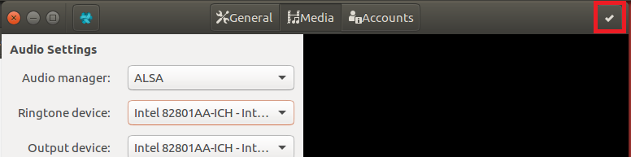

Configure medias : Audio settings
==============================================
In order to change the audio settings, first go to the Media tab on your ring app. To do that,
first click on the gear icon at the top right of the ring window. 

A window such as the one below should be displayed

Next, click on the media tab.

================
Audio Settings
================
Audio manager
-----------------
Selects which sounds manager to choose from the list installed on your machine.
By default, ALSA_ and PulseAudio_ should be installed.

.. _ALSA: https://www.alsa-project.org/main/index.php/Main_Page

.. _PulseAudio: https://www.freedesktop.org/wiki/Software/PulseAudio/

Ringtone device
-----------------
Selects which device to use as ringtone.

Output device
-----------------
Selects which device/driver to use as output.

Input device
-----------------
Selects which device/driver to use as input.

===================
Validate Changes
===================
Once you are done with the changes, simply click on the checkmark at the top-right of the window.

