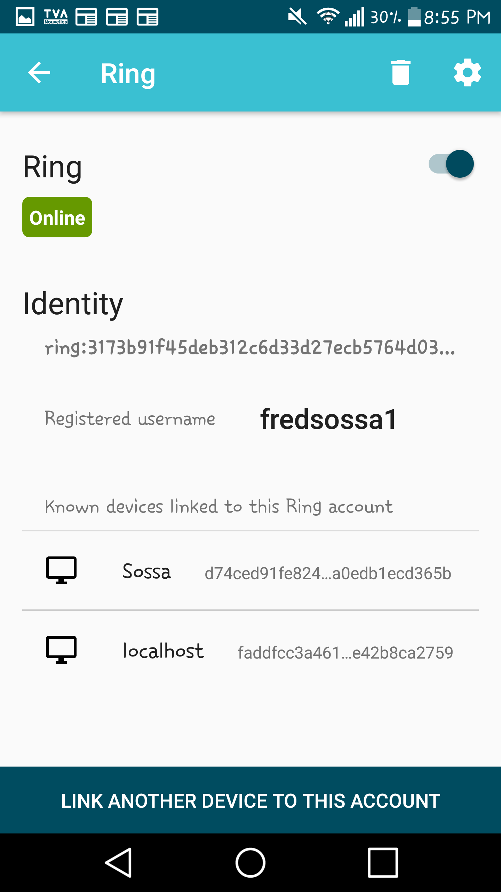
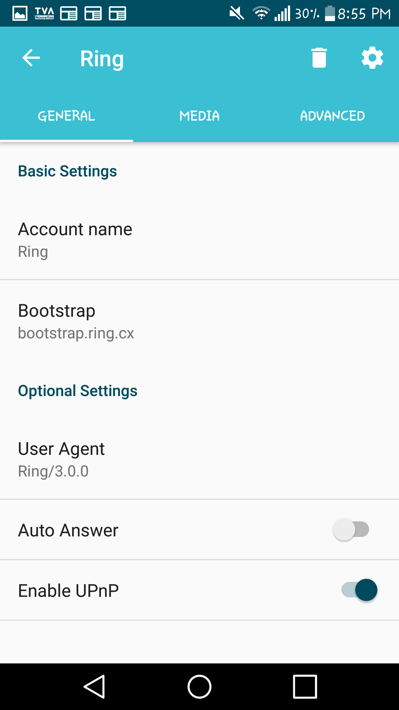

.. _configurer_media_video_android:

Configure media - Video
=======================

Launch Ring.

Go to your account's parameters (the three bars in the top-left corner ofyour screen). 

.. image:: capture1.png

Select Manage your accounts.

Select your ring account.

.. image:: capture3.png

Go to your settings (the widget in the top-right corner of your screen).

Choose the Medias tab.

Scroll until you reach the Video section and choose the options that you want to keep.

.. image:: capture6.png

