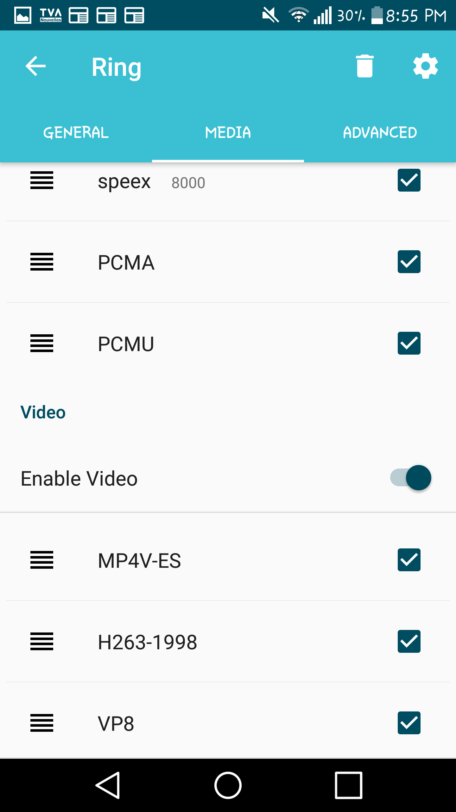

Configure media - Video
=======================
Now that you have downloaded GNU Ring, you can use it to exchange messages and call your fiends. Before having your first video call, you need to configure your media by allowing GNU Ring to use your device (Camera) for calls. Here are the steps to configure your media with some screenshots to make it easier.

First, Launch Ring on your device.

1.Go to your account's parameters (the three bars in the top-left corner ofyour screen):

2.Select Manage your accounts:

.. image:: capture2.png
	:height: 100px
	:width: 200px
	:scale: 100%
	:alt: Nothing else than a pict
	:align: center

3.Select your ring account:

4.Go to your settings (the widget in the top-right corner of your screen):

.. image:: capture4.png
	:height: 100px
	:width: 200px
	:scale: 100%
	:alt: Nothing else than a pict
	:align: center

5.Choose the Medias tab.

.. image:: capture5.png
	:height: 100px
	:width: 200px
	:scale: 100%
	:alt: Nothing else than a pict
	:align: center

6.Scroll until you reach the Video section and enable video:

If you are a novice, just leave the codecs choice like that.

