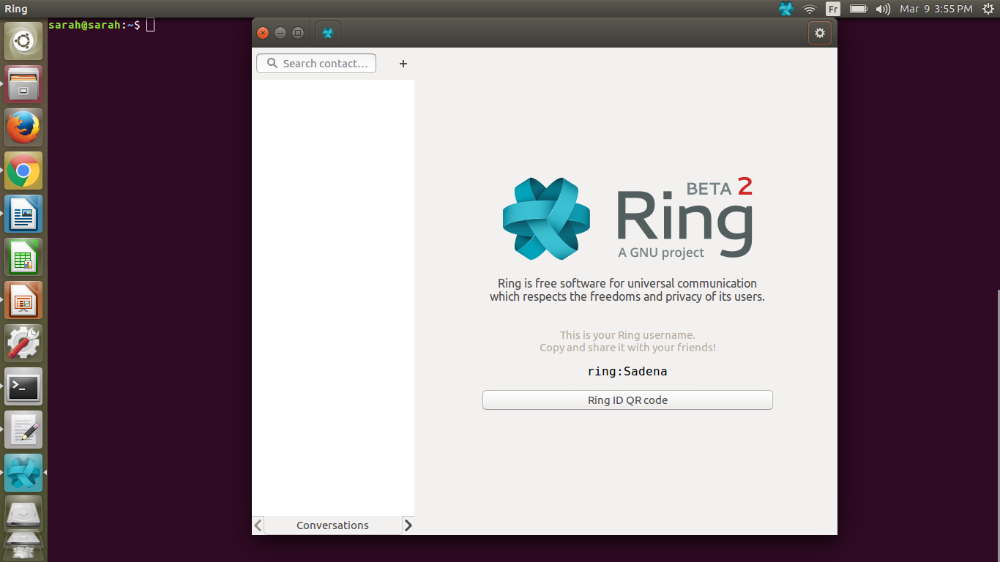
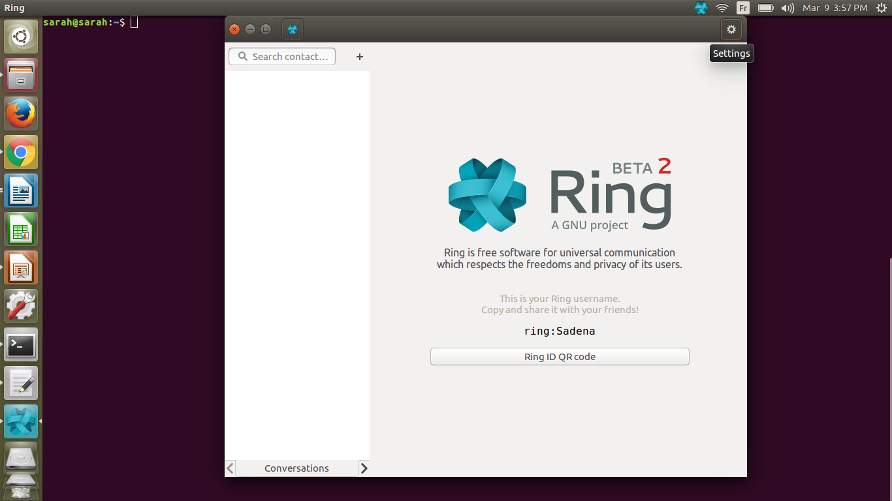
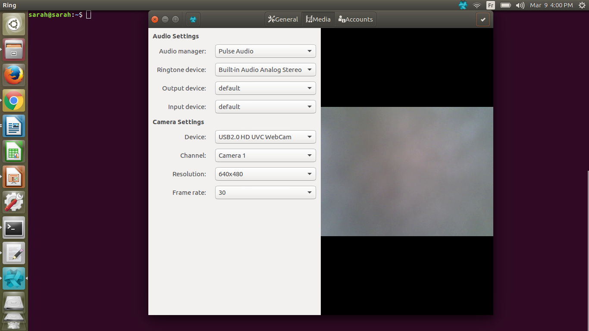
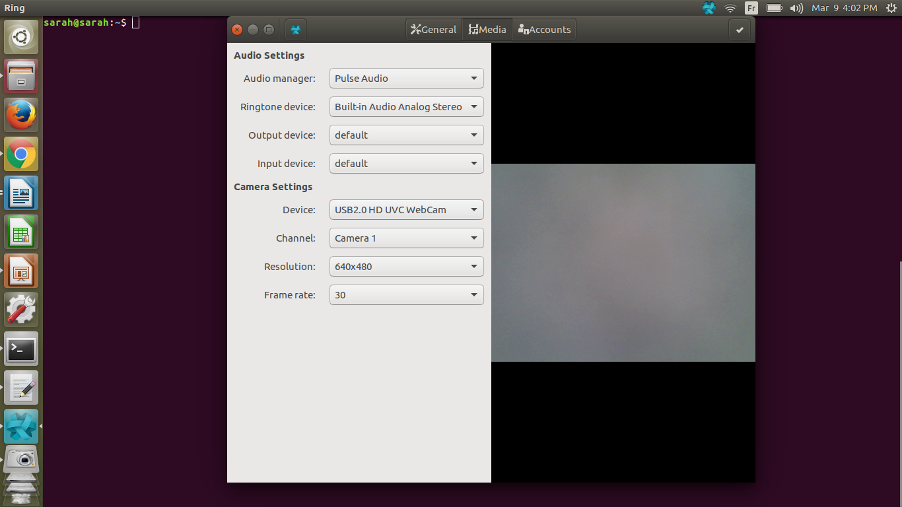
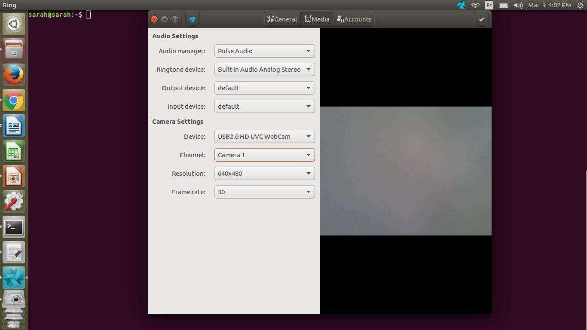
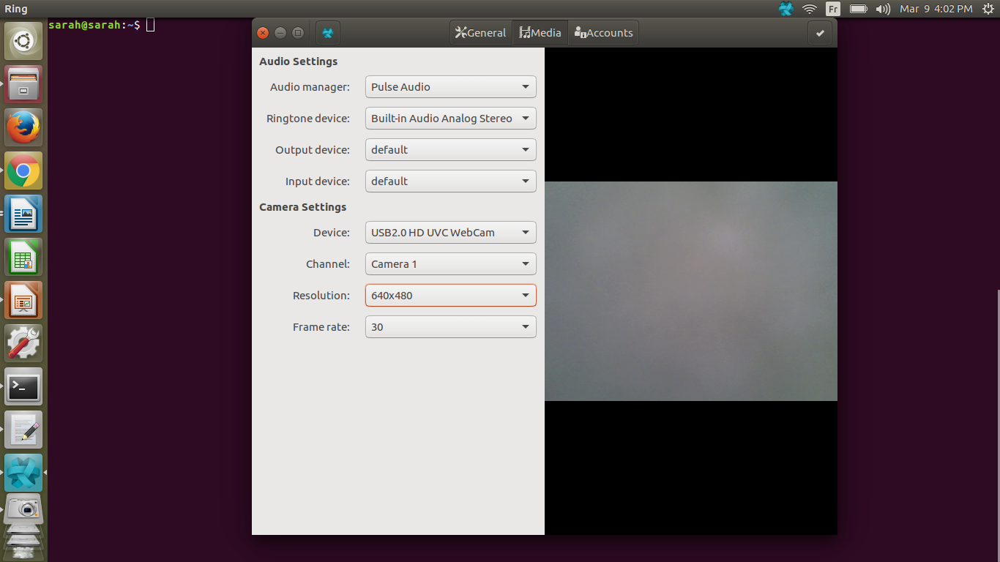
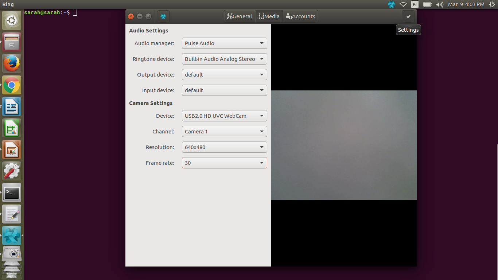

Comment configurer le media vidéo
=============================
Pour les clients Gnome
----------------------

|ouverture|
Voici la page principale de Ring. C'est cette page qui apparait après que l'utilisateur se connecte.

|settings|
Pour accéder aux paramètres, il faut cliquer su le petit logo "settings", dans le coin supérieur droit.

|camera|
Dans la section de paramètres, il faut selectionner "Media", dans la barre noir du haut. Dans cette section, on retrouve les paramètres audio et visuel. Nous focuserons sur les paramètres visuel.

Il y a quatre paramètres :
	1. Device
	2. Channel
	3. Resolution
	4. Frame rate
	

Device
------

En cliquant sur la partie "Device", vous pouvez choisir le matériel à utliser comme support visuel.  |device|

-------------

Chanel
------

Si le matériel selectionné dans "Device" contient plus qu'une caméra, c'est avec le channel que vous choisissez celle que vous voulez utiliser.|channel|

-------------

Resolution
----------

Il y a 6 différentes résolution qui peuvent être choisies
	- 640x480 (pixels)
	- 352x288 
	- 320x240 
	- 176x144 
	- 160x120
	- 1280x720
Le choix de résolution affecte la qualité de l'image, en modifiant le nombre de pixels par unité de longueur. Il faut choisir la résolution en fonction de la caméra, car elles ne supportent pas toutes les résolutions. Par exemple, la 1280x720, qui correspond a une qualité HD, n'est pas prise en charge par n'importe quelle caméra
|resolution|

--------------

Frame rate
----------

Le "frame rate", ou images par seconde, affecte aussi la qualité de l'image. Plus il est élevé, plus l'image est fluide. 
Ici, les choix dépendent de la résolution choisie.
	Pour la résolution 1280x70 : 
		- 10
		- 8
		- 30
		- 15
	Pour les autres résolutions :
		- 30
		- 25
		- 20
		- 15
|frame|

------------

Sortir
------

Lorsque tout les paramètres sont choisis, vous pouvez cliquer sur le petit crochet dans le coin supérieur droit pour sortir
|sortir|

