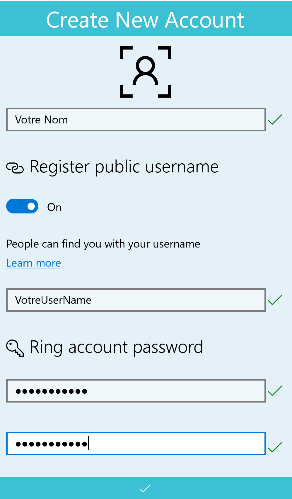
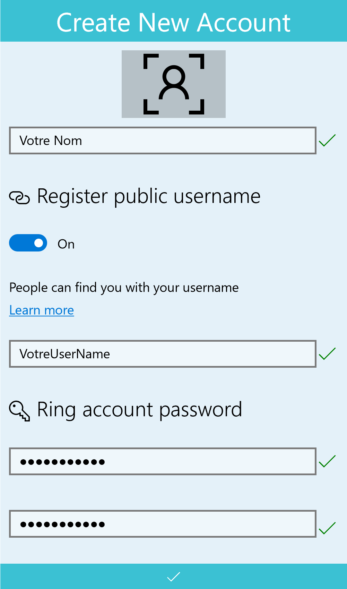
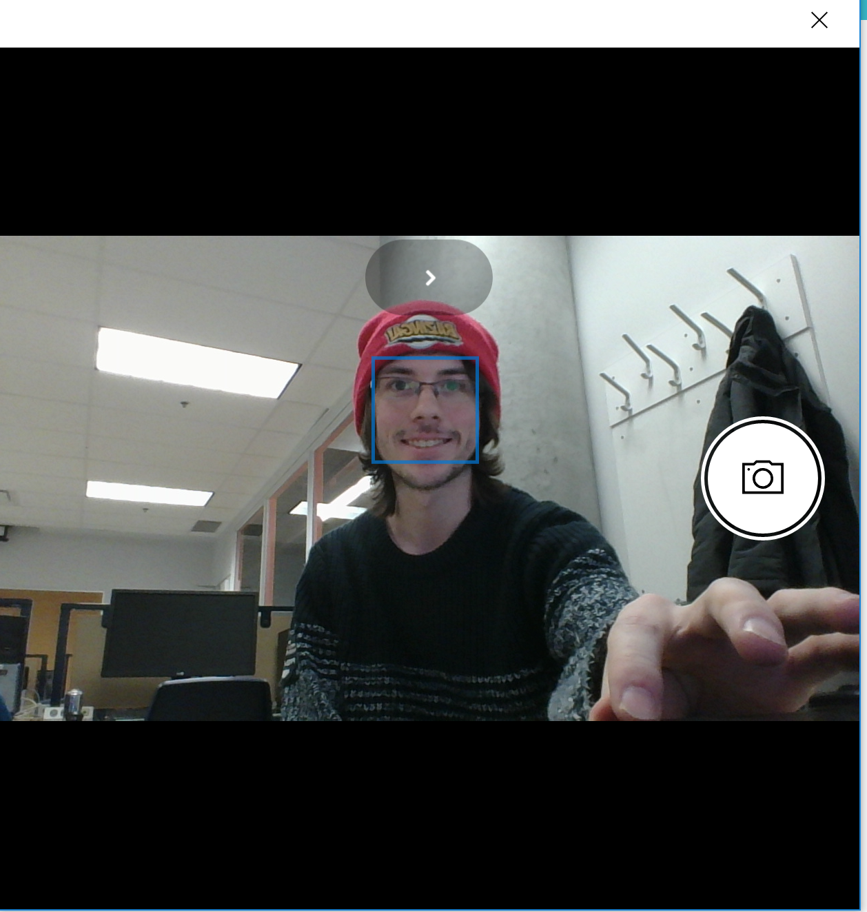
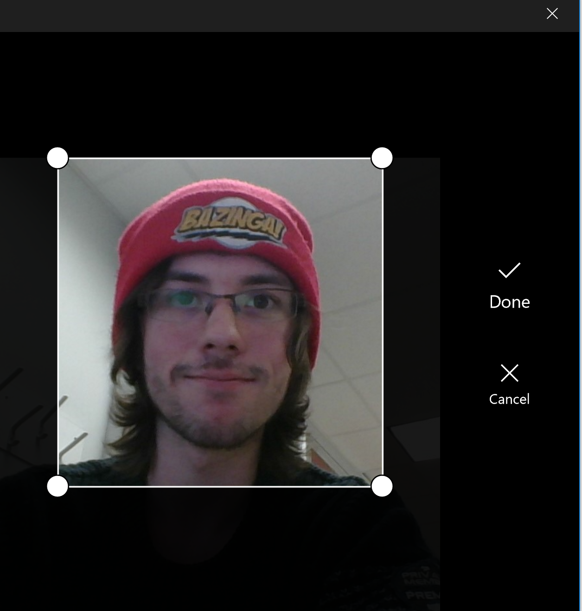
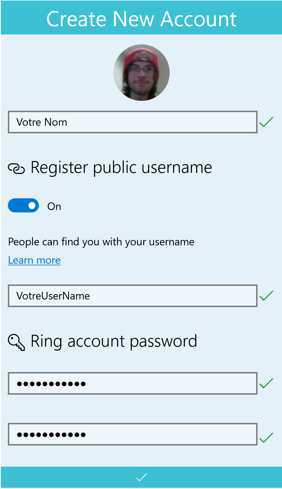
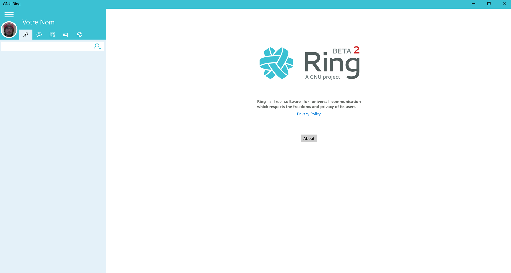

Image du profil
========================

1. Créer un profil
------------------------------------------------------------------------------
Il faut créer un profil sur l'application. Entrez vos informations.

2. Appuyer sur l'image de profil
------------------------------------------------------------------------------
Il faut appuyer sur l'image en haut. Celle-ci deviendra grise lorsque le curseur pointera dessus (tel qu'illustré ci-dessous).

3. Prendre la photo
------------------------------------------------------------------------------
Il faut prendre une pose. Lorsque vous êtes satisfait, appuyez sur le bouton à droite représentant un appareil photo. La photo sera prise.

    
4. Rogner la photo
------------------------------------------------------------------------------
Il faut rogner la photo afin d'avoir une meilleure vue sur votre visage. Si vous n'êtes pas satisfait de la photo, il suffit de simplement appuyer sur le bouton Cancel. Si au contraire vous êtes satisfait, vous pouvez appuyer sur le bouton Done.

5. Valider la photo
------------------------------------------------------------------------------
Avant de valider votre profil, vous pouvez toujours modifier la photo en appuyant sur la photo en haut. Si tout est correct, appuyez sur le crochet en bas pour valider le profil.

6. Modifier la photo après la création du profil
------------------------------------------------------------------------------
Il est possible, en tout temps, de modifier votre photo de profil. En effet, il vous faut simplement appuyer sur la photo en haut à gauche. Les étapes de modification seront alors les mêmes qu'aux points 3 et 4.

