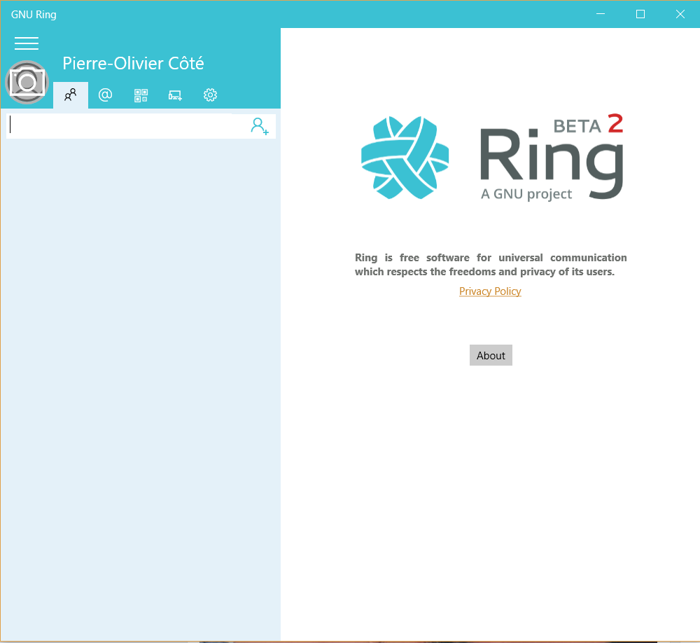
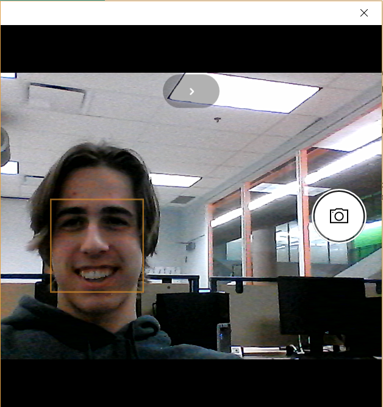
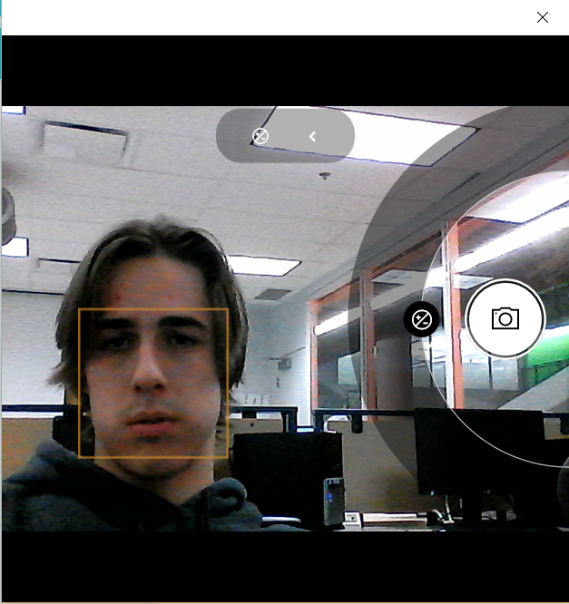
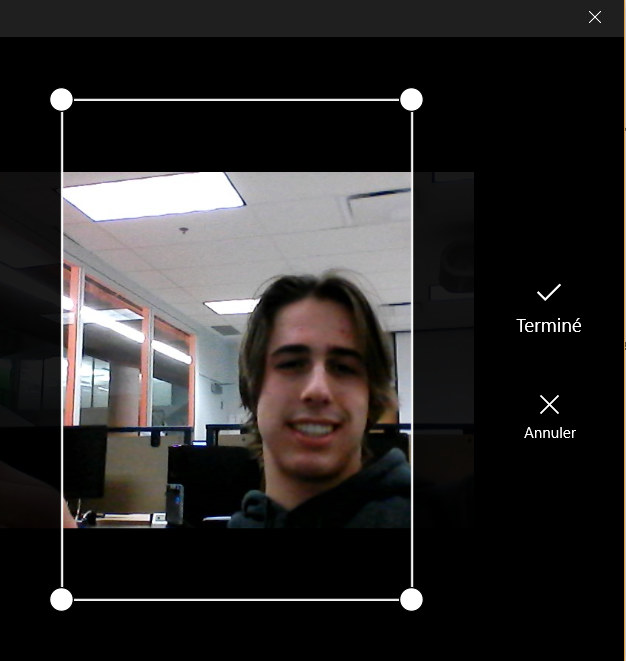

============================================
Set your Ring's profile picture on Windows
============================================

1.	Open Ring and sign in to your account. You should reach Ring's homepage :

2.	In the menu on the left side of the screen, click on your profile picture right next to your name.

3.	Clicking on the camera icon on the right side of the screen will take a picture. To acces professional mode, you can click on the icon on the top of your screen.
	

4.	Professional mode will allow you to modify the exposure of your webcam by dragging the icon that popped on your right.

5.	Once you've taken your picture, you will be able to resize the picture by dragging the rescaler. To center your profile picture, drag it
	in the rescaler.

6.	Finally, when you are satisfied with the result, click on the "Confirm" icon to set your new profile picture.

