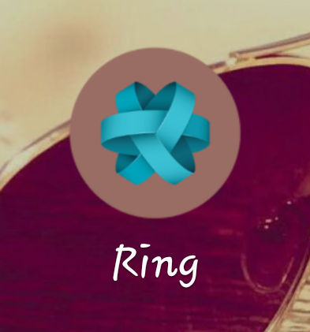
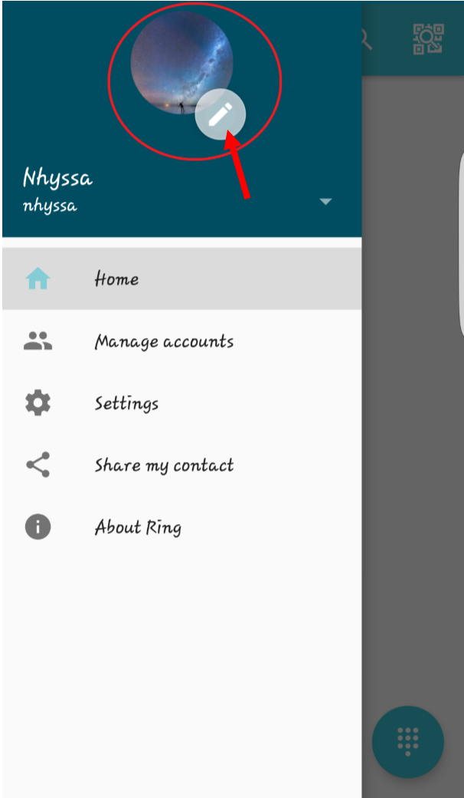
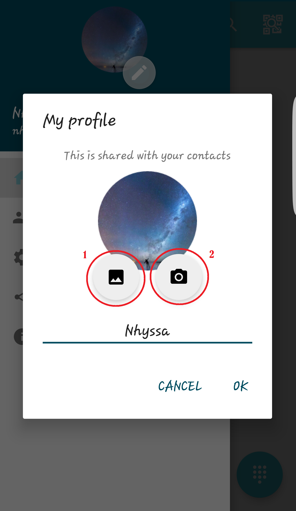
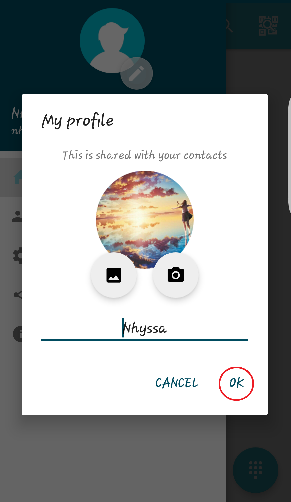
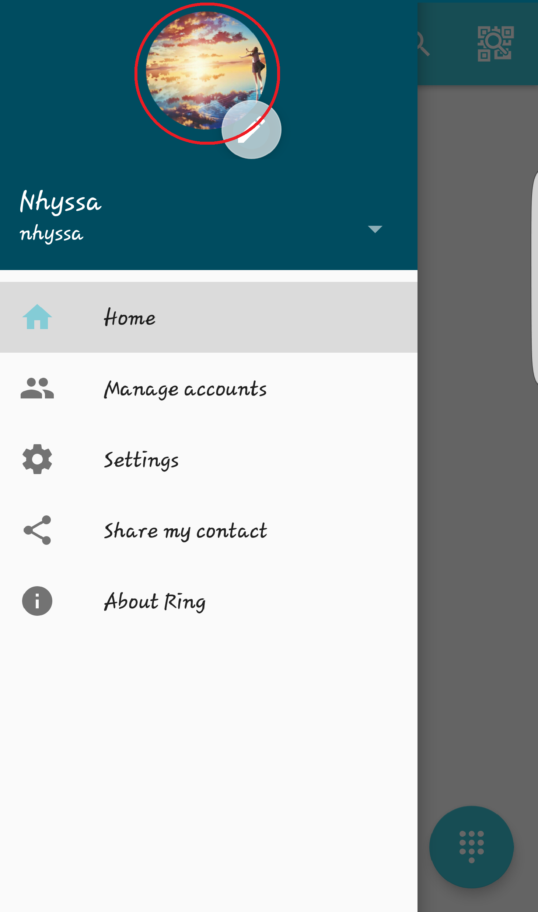

=============================================================
How to configure a profile picture on an Android Ring account
=============================================================

**This documentation is a tutorial aiming at helping you setting up** 
**a profile picture for your Ring account on your android device.**
**This picture can be seen by the other users of Ring.**

**We suppose that you already have downloaded and installed the** 
**application, and that you have an account linked to your device.**

|
|
|

**1.** The first step is for you to launch the application, by tapping on it.

|
|

**2.** When Ring starts, the main page opens. There, you can **click on the menu** *(pointed by the red arrow on the picture below)* at the left top of the screen.

.. image:: ./configurer_profile_android/Capture2.png
   :height: 100px
   :width: 200 px
   :scale: 100 %
   :alt: text
   :align: center

|
|

**3.** This menu shows you a list of rubrics. To access and modify your profile picture, you can tap on the **circle with the pencil**, beneath the larger one where you can see your current profile picture *(as shown on the screenshot below)*.

|
|

**4.** The next window you’ll see shows you your current profile picture *(if you have one)*, and just beneath it you can see **two buttons**. 

	- The first one allows you to choose a **new picture from the gallery** on your device. When you click on it, your gallery opens, and you can navigate through your pictures, and tap on the one you want to select. It will automatically get set up, and bring you back to your Ring profile settings window.

	- The second one will open your camera. You can thus **take a picture with you device**, and use it as your profile picture. It will automatically get set up, and bring you back to your Ring profile settings window.

|
|

**5.** Once you’ve chosen your new profile picture, you’ll be brought back to the window where you clicked one of the buttons at the last step. To confirm your changes and upload your new profile picture, you need to tap on **“Ok”**. Otherwise, you can cancel the changes by tapping on **“Cancel”**.

|
|

**6.** As you can see on the next window, you’re profile picture has been correctly set up (if you followed the last steps, otherwise start from the third one).

|
|
|

**Congratulations! Now you know how to set up your profile picture.**
