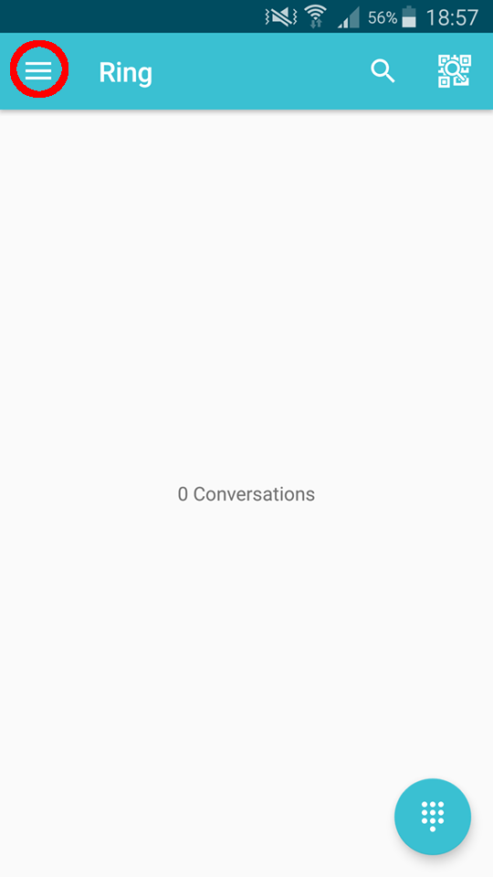
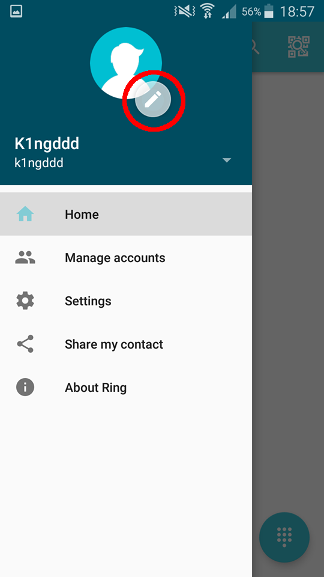
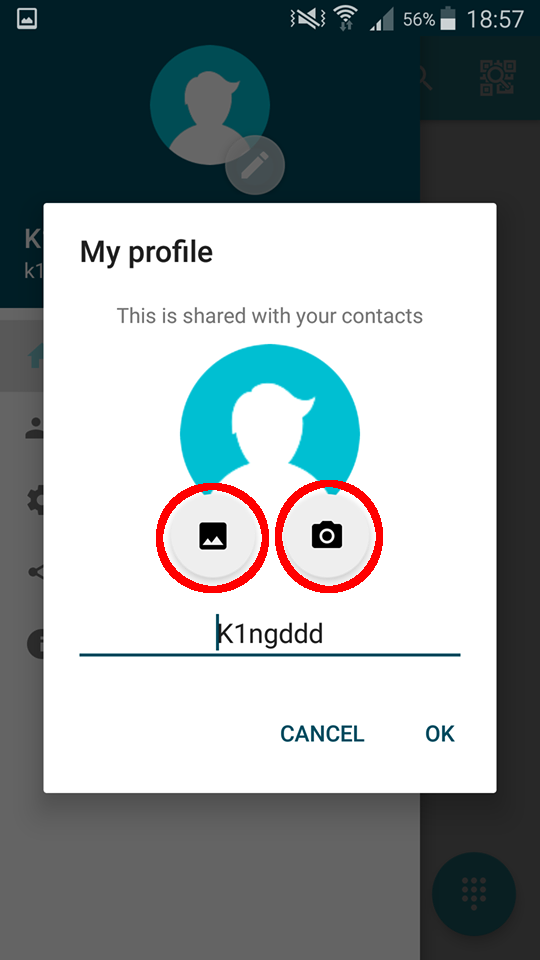
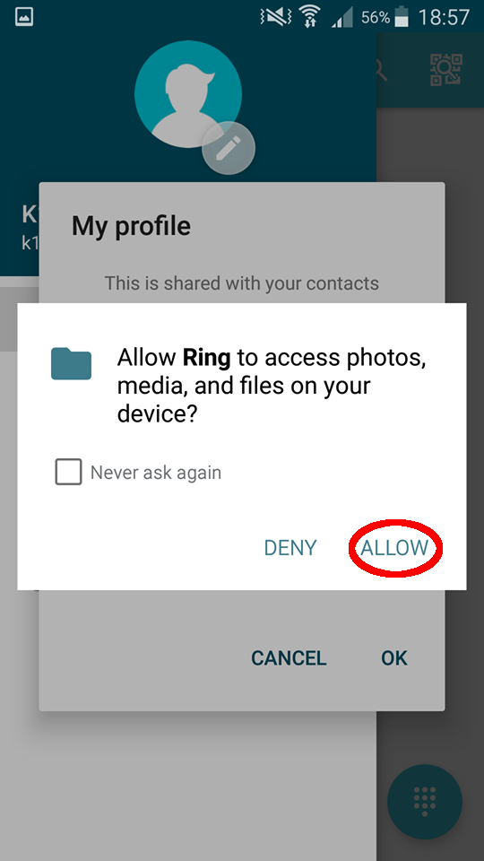
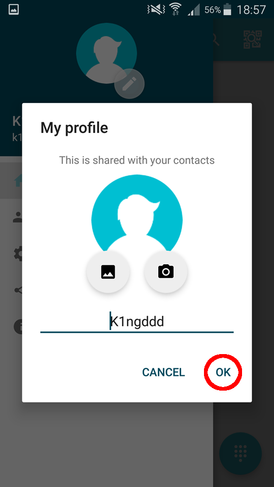

Configure your Ring profile image
=======================================================================
A profile image is used to visualize yourself towards other users. Changing one's profile image in Ring is very simple and can be made in 4 small steps:

1 - Once Ring is launched and you've connected to your Ring account, press on the three horizontal bars in the top left corner.

2 - Find and press on the circle with a crayon icon in the top of the menu that appears.

3 - If you want to set an existing image as your profile image, press on the left hand side icon under your ID. If you wish to take a new photo with your camera, press on the right hand side icon under your ID.

If Ring asks for access for your photos, please allow it. If you refuse, it will be impossible to modify your profile image.

4 - Accept the changes if you are satisfied with your choice by pressing on the "OK" button in the bottom right side of the menu.

