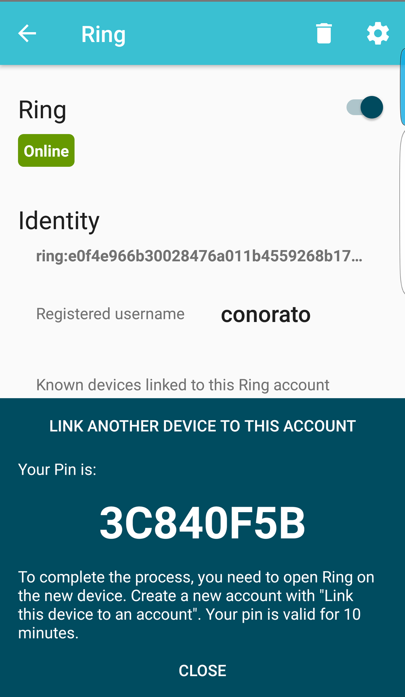

============================================
Connect another device to a Ring account
============================================

This short tutorial will show you how to add multiple devices, such as another mobile phone, a linux or a windows computer, to a single Ring account. You will only need your android mobile phone and the other device that you want to connect your account into. 

- Download the application and log in with your current device. You will also need to install (if that's not already done) Ring on your other device. Other tutorials about this step are available on this site (see the download, the installation and the opening tutorials according to the operating system you are using).
- Click on the three horizontal bars on the top left corner of your screen 

- Select "Manage accounts"

- Click on the name of the account that you want to enable the access from another device

- Now, to connect a device to the account, you need to generate a PIN code by clicking on "Link another device to this account" at the bottom of the screen

- Enter your password that you previously created and a PIN code will appear. This pin is only valid for 10 minutes, so it's easier if you have already downloaded and logged into Ring on the other device. 

- Copy and paste the PIN code on the new device you want to link by clicking on "Link this device to an account". You will also need to write the password of the account you want to link your device to.

When you are done with theses steps, you will see that there are now several 
devices connected to your Ring account, as you can see here: 

.. image:: connecter_app_android/capt10.png
   :scale: 30 %
   :align: center
