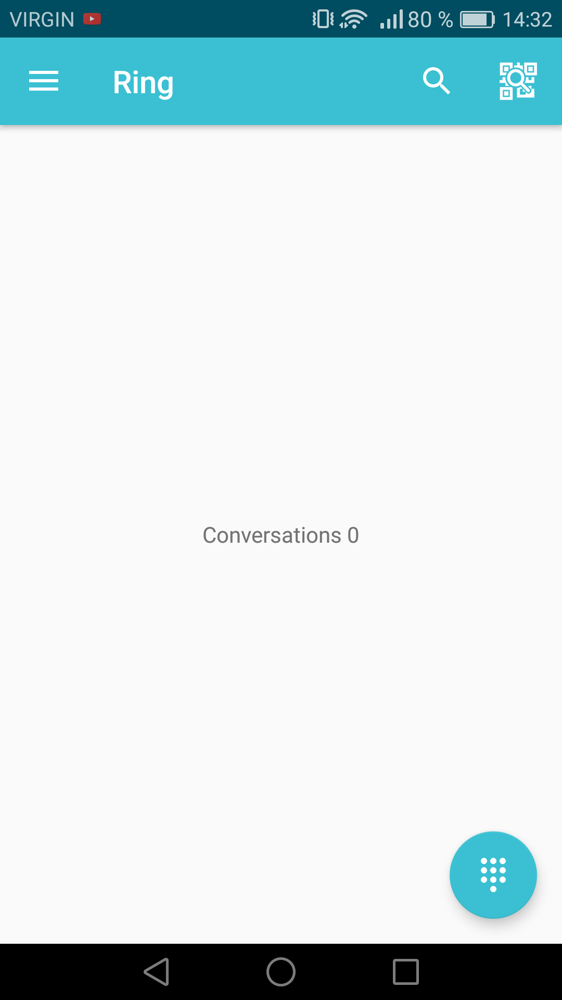
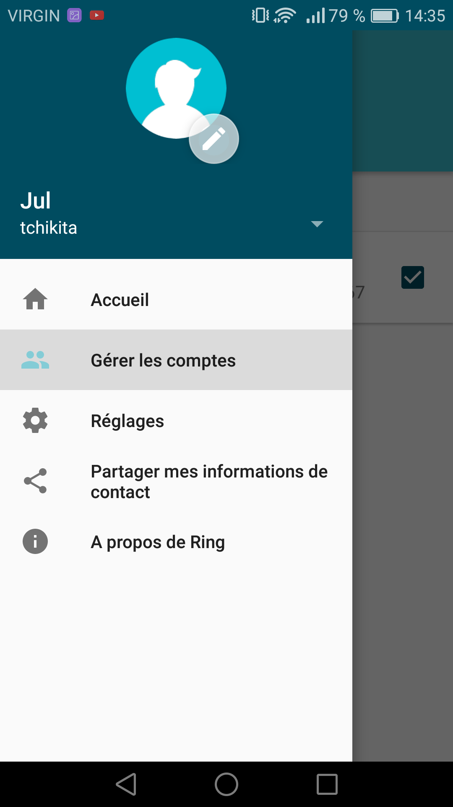
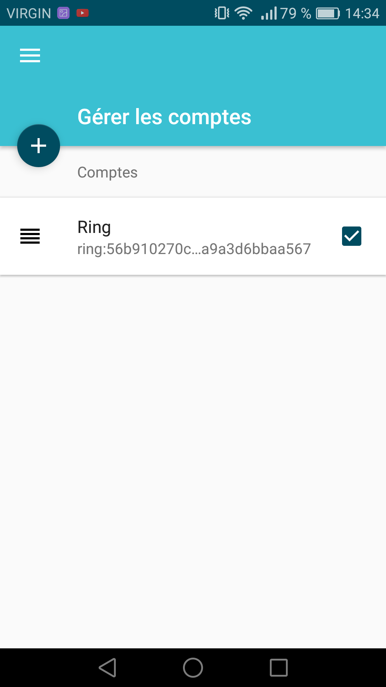
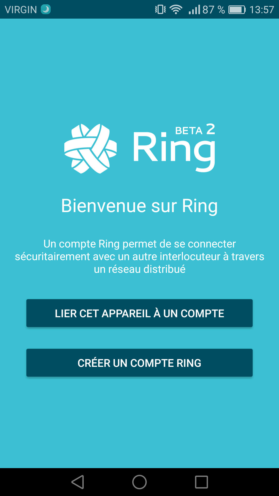
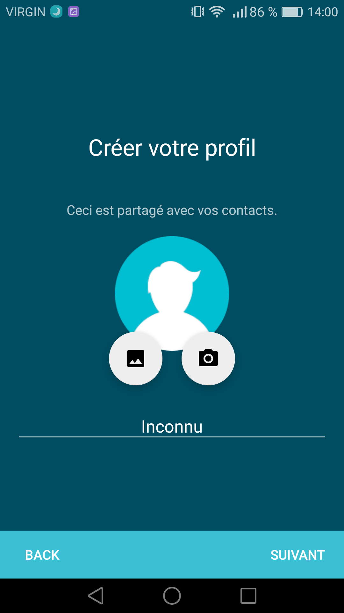
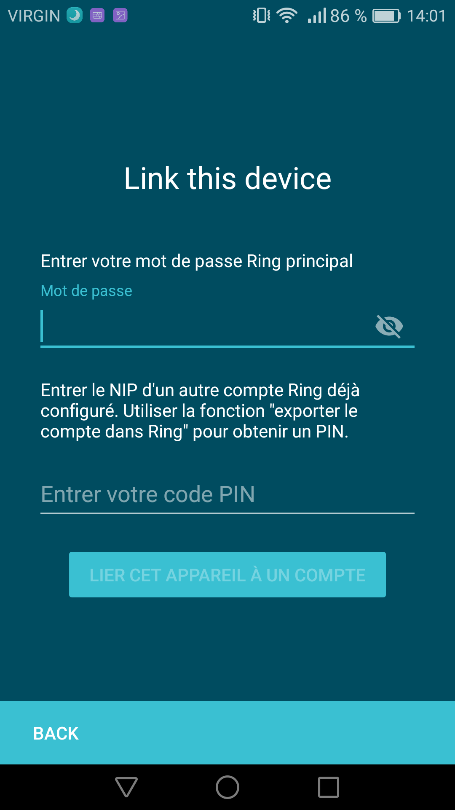
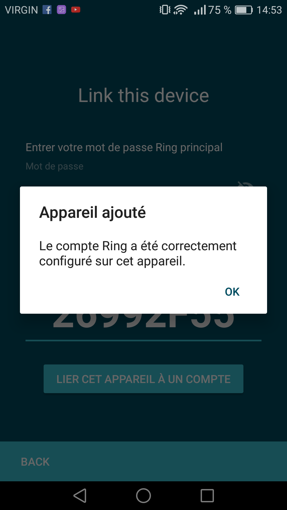

.. _connecter:

==================================================
 How to link your device to your account (Android)
==================================================
From a device that already has an active account on it 
------------------------------------------------

- Get your `PIN <https://ring.cx/fr/documentation/faq#node-204>`_

From the device you want to link to your account
----------------------------------

Open the dropdown menu
######################

- From the home page, open the dropdown menu

- Sélectionner **Manage your account**

Press on the **+** button
###################
- From the page *Managing your account* , press on the **+** button.

Press on LINK THIS DEVICE TO AN ACCOUNT
######################

- Select **LINK THIS DEVICE TO AN ACCOUNT**. 

Create your profile
#######################

- Enter a username and choose a profile picture, then press  **next**

Link your device
################

- Enter your password and enter the PIN we collected.

- You linked your device to your account with succes !

