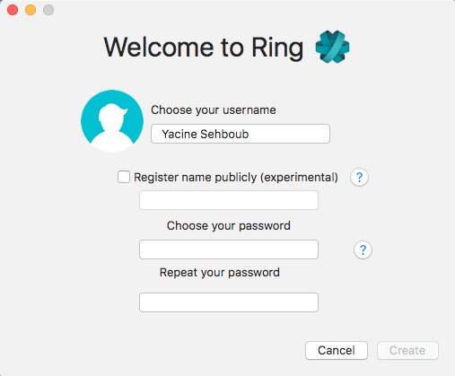
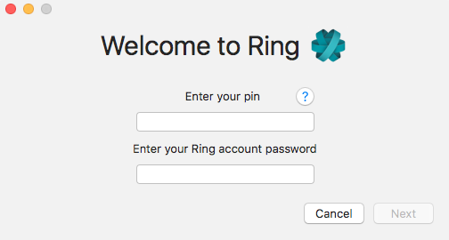

==========================================
Création et configuration d'un compte Ring
==========================================
Pour pouvoir utiliser les fonctionnalités que Ring offre, il faut d’abord créer un compte. Ce compte vous permettra de communiquer, de façon sécurisée, à distance avec vos proches, vos amis ou même en milieu professionnel. Vous pourriez alors appeler ou recevoir des appels par l’intermédiaire de votre compte Ring qui servira de référence à un réseau distribué.

Création du compte
==================

Après avoir ouvert l’application Ring pour la première fois, vous devriez voir sur votre écran ceci :

.. image:: 1.png
    :width: 400px
    :align: center
    :height: 800px
    :alt: alternate text

Tapez sur « **CRÉER UN COMPTE RING** » pour débuter la création d'un compte Ring.

Configuration du compte
=======================

Vous devez maintenant saisir les informations demandées pour la configuration de votre compte Ring.

.. hint:: Vous pouvez quitter cette page, à tout moment, en appuyant sur la flèche de retour en haut à gauche de votre écran. |logo|

Choix d’un nom d’utilisateur (optionnel)
----------------------------------------

En appuyant sur l’écran à l’emplacement « **Entrez un nouveau nom d’utilisateur** », vous serez en mesure d’écrire un nom d’utilisateur que vous aurez choisis.

.. warning:: Vous ne pouvez pas choisir un nom d’utilisateur déjà pris par un autre usager.

Si vous ne désirez pas choisir un nom d’utilisateur, appuyez sur le bouton à droite de « **Enregistrer un nom public** ». |logo2|

Notez que vous pouvez en choisir un après la création de votre compte, à tout moment, dans l’option de l’onglet de navigation « *Gérer les comptes* ».

Choix d’un mot de passe
-----------------------

Une fois que vous avez choisis un nom d’utilisateur valide ou que si vous avez choisis de ne pas choisir un nom d’utilisateur, vous devez maintenant associer à votre compte un mot de passe. Ce mot de passe servira à ce que vous soyez la seule personne ayant accès à ce compte lié à votre appareil Android. Il doit comporter au minimum 6 caractères et peut être composé de lettres et de chiffres.

Appuyez maintenant sur l’espace réservé à la saisie du mot de passe « **Nouveau mot de passe** » et rentrez s’en un. 

Remarquez que vous ne pouvez voir ce que vous écrivez par mesure de sécurité. Au besoin, vous pouvez consulter votre saisie de texte en appuyant sur l’image de l’œil à droite du champ fourni à l’écriture. |logo3|

Ensuite, tapez-le encore dans l’emplacement suivant, « **Confirmez le mot de passe** » pour confirmer ce que vous avez écrit précédemment. Les 2 champs doivent être remplis des mêmes caractères. Assurez-vous de ne pas oublier votre mot de passe. Vous en aurez besoin pour accèder a votre compte Ring.

.. image:: 4.png
    :width: 400px
    :align: center
    :height: 800px
    :alt: alternate text

Une fois le choix du mot de passe terminé, appuyez sur « **CRÉER LE COMPTE** » pour terminer la configuration du compte et le créer. Vous devriez voir apparaître à l’écran une boite de notification mentionnant l’état de la création du compte. Il est important de patienter quelques instants pendant que le compte est ajouté et lié à votre appareil.

.. note:: Dans l'exemple ci-dessous, j’ai choisis de ne pas mettre de nom d’utilisateur.

.. image:: 5.png
    :width: 400px
    :align: center
    :height: 800px
    :alt: alternate text

Une fois l’ajout du compte terminé, une deuxième boite de notification mentionnera que la création du compte a bien été réussie. Appuyez sur « **OK** » pour passer à votre page d’accueil. Félicitation, vous pouvez maintenant ajouter d’autres comptes et passer des appels sécurisés de haute qualité!

