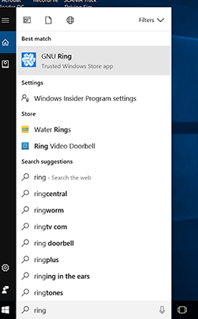
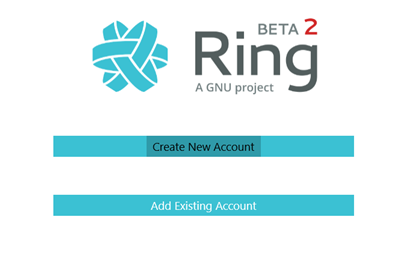
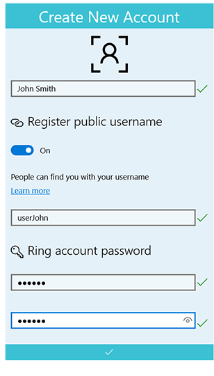
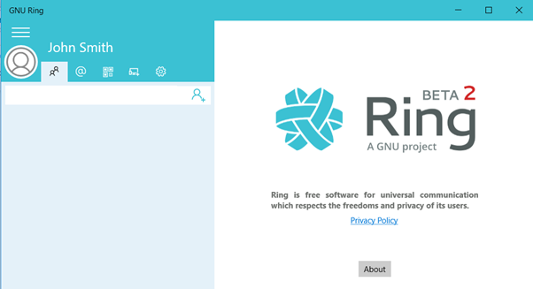

.. _how_do_i_create_a_ring_account?:

**How do I create a Ring account?**
==============================================

1. **Start the application GNU Ring**

2. **On the Ring screen, select "Create New Account"**

3. **Create a user name and a password for your account and clic on the tick**

4. **Now, your account is successfully created, enjoy using Ring !!!**

