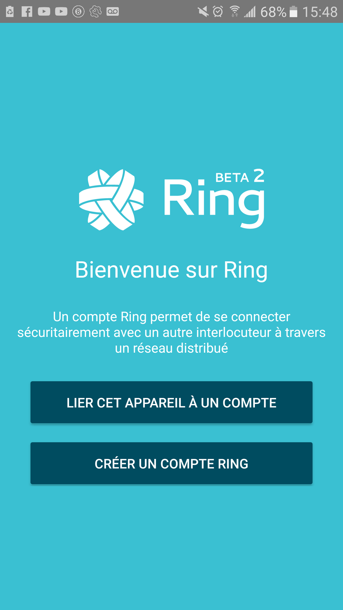
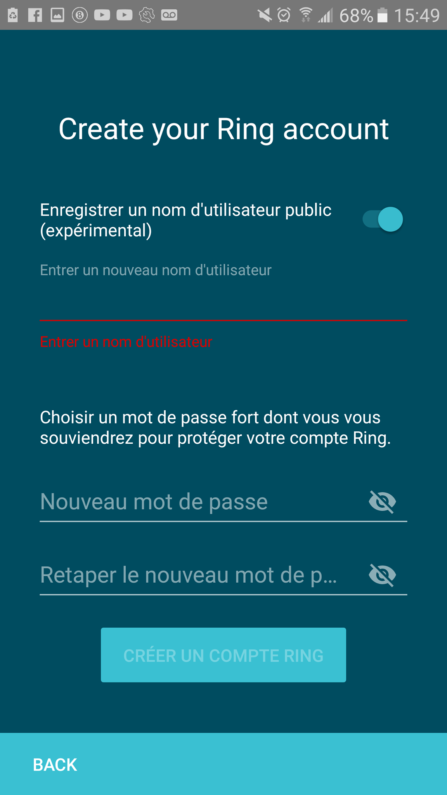
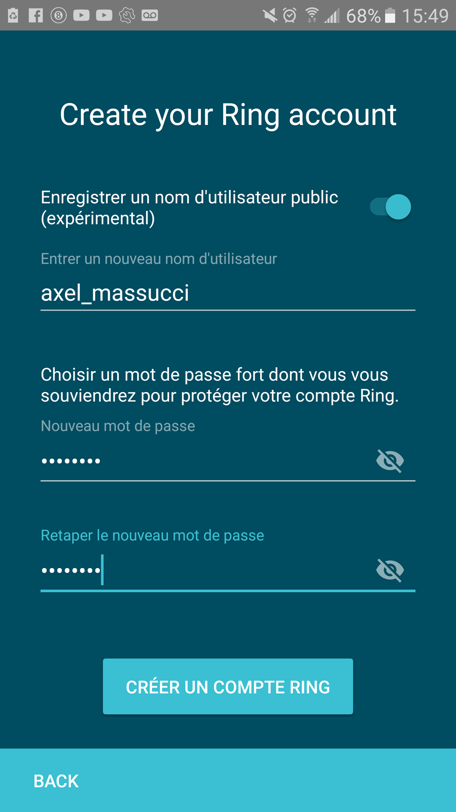
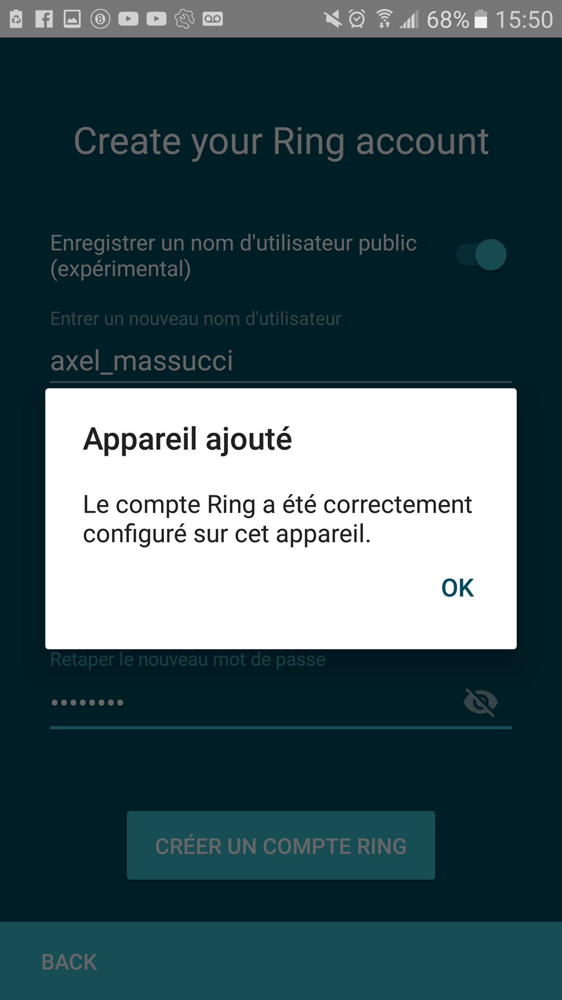

Creer un compte Ring sur android
================================
Etape 1
-------

Sur la page principale de Ring appuyer sur "CREER UN COMPTE RING"

Etape 2
-------

Entrer votre nom et une image si vous le desirer puis appuyer sur suivant.

Etape 3
-------

Entrer un nom d'utilisateur qui sera public, votre mot de passe puis confirmer votre mot de passe.

Etape 4
-------

Appuyer ensuite sur "CREER UN COMPTE RING"

	
Votre compte est maintenant cree et votre appareil est ajoute.

