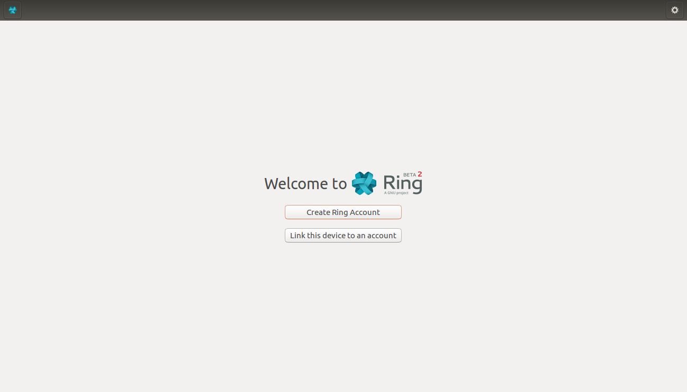
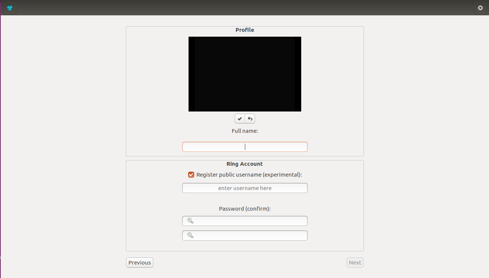
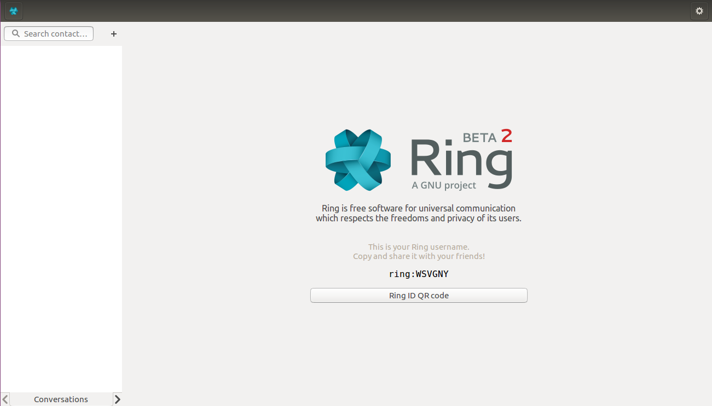
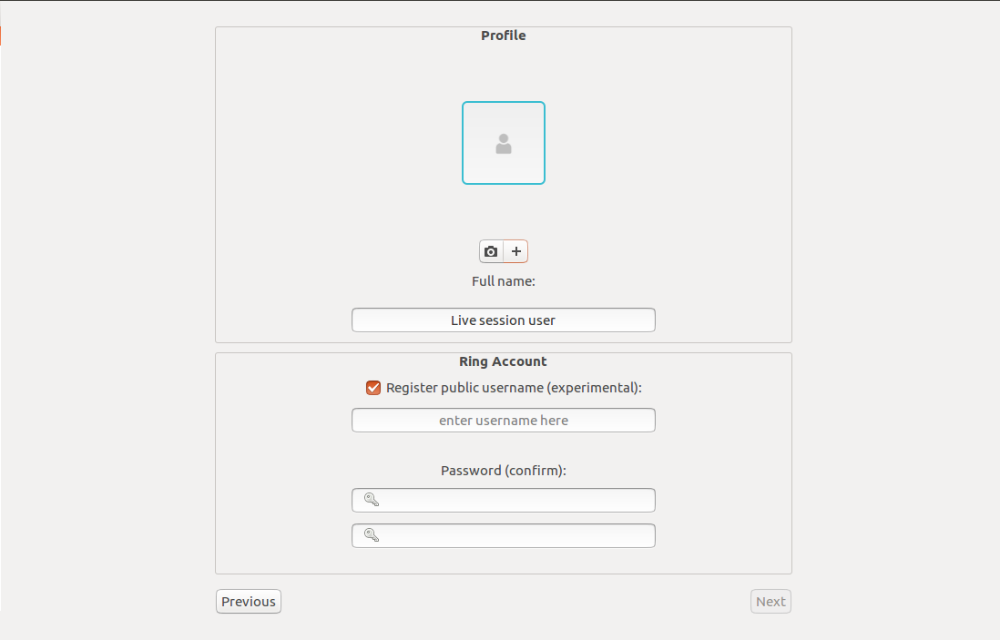

Creating a new Ring Accout
=============================
For Gnome clients
----------------------

-------------

On startup
------

After installing and starting GNU Ring for the first time, the following window will appear

|open|

Clicking the "Create Ring Account" option will open up the account creation window

|create_new_account|

-------------

Selecting a profile picture
------

The first step in creating a new Ring account is selecting a profile picture. However, keep in mind that this step is purely optional.

Clicking the checkmark option will take a new photo from you webcam and save it as your profile picture. 

To import an existing photo, select the "return" option next to the checkmark.You will then have to click on the "+" option in order to open your file explorer.

|register_off| 

You can always click the camera icon next to the "+" option to go back and take a new picture.

-------------

Entering your username
------
	
Below, the mandatory "Full name" field requires you to write your first and last names before you can proceed to create your account.

You should then enter your desired username in the username block. Ring will shortly inform you if the entered username is valid or already taken.

Checking the "Register public username" case will allow others to search and add you using your username instead of your RingID. You can uncheck it if desired.

-------------

Entering your password
------

Finally, you'll have to choose and confirm a password for you Ring account. To do so, just enter your password in the first text field and then re-type it in the field below

When you're all done, clicking the "Next" at the bottom right corner will take you to the next step. 

If you feel like you missed something while the "Previous" icon will bring you back to the first window.

-------------

Your new account
------

Congratulations, you've succesfully created you own Ring account!
You should now be able to login at any time into your account and use Ring.

|register_on|

