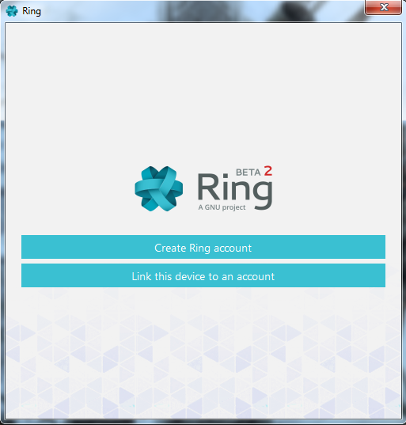
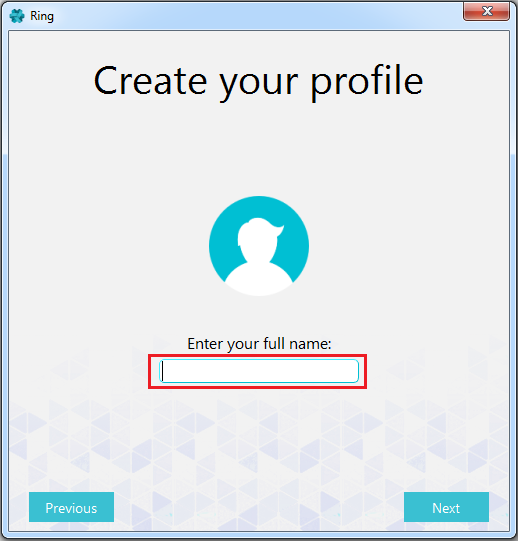
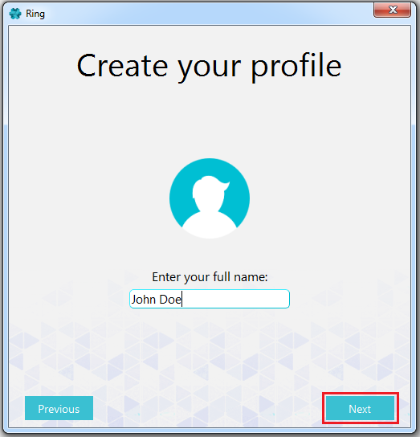
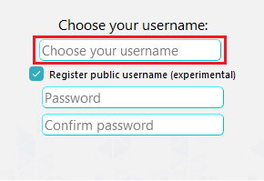
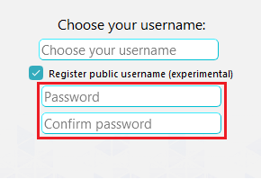
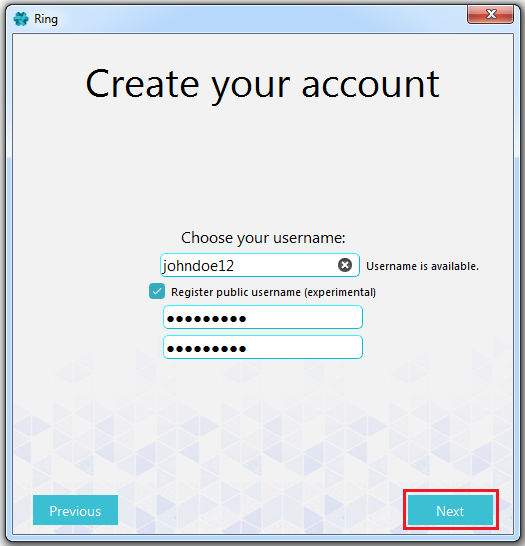

.. Tutorial made by Léandre Guertin and Boubacar Telly Bah

Create an Account on Windows
============================

After installing and turning on Ring on Windows, a screen simular to this should be opened:

In this tutorial, you will be shown how to create an account using the Ring feature on your Windows device. This tutorial is 6 *easy* steps that will make sure that you can manage to create an account.
In order to create an account:

1. Select "Create Ring account" right beneath the Ring logo

2. Type in your full name in the blank field "Enter your full name:"

3. Press on "Next" at the bottom right of the screen to create your profile

    
4. In the field "Choose your username:", enter a username for your account. This username is the one you'll use in the future to sign in your account.

5. In the field Password, type in your password for your account and confirm it right below.

6. Press on "Next" at the bottom right of the screen to create your account 

    
    
Now that you have successfully created an account, you can now access to all of the functionnalities that Ring can offer you.
