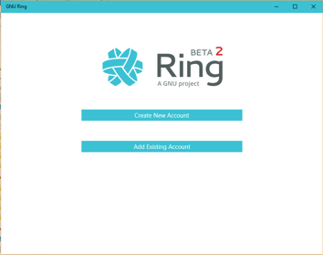
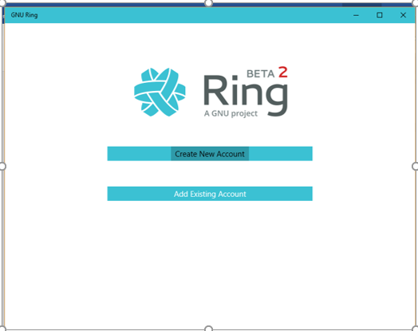
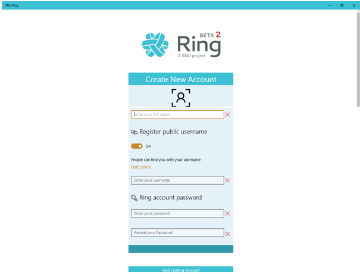
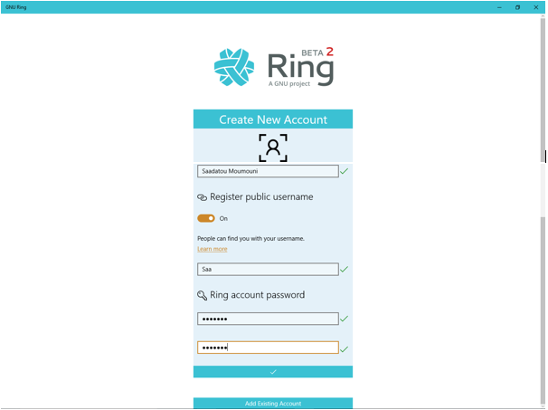
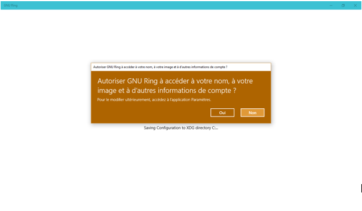
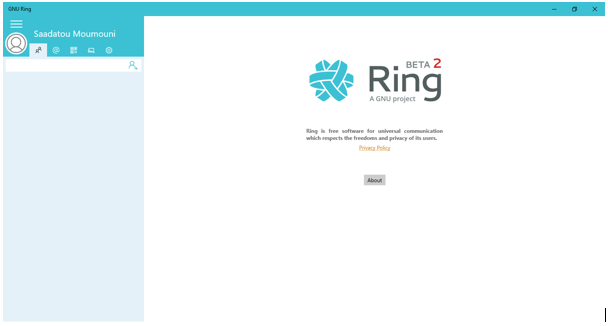

Documentation des étudiants "1607679" et "1771817"
========================================================

To create a ring account on windows for the first time, you have to follow these steps.

When you open ring after installing it on your windows, you have this display.

1. Click on the first option "create new account" 

2. You have to fill in the fields

3. Once all fields have been filled in and then click on "✔" to validate the creation of your account.

4. You will then see a dialog box that will prompt you to allow ring to access your account information.

5. Finally you will be able to access the functions of ring 

