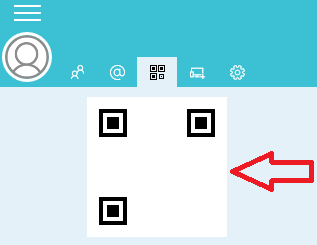

.. _displayQR:

Display QR Code under Windows
=============================

In order to share your contact informations easily, Ring offers a QR code
functionality. This QR code can be use by other Ring users to add you
in their Ring contacts!

You can acces this QR code by following the steps below:

Instructions
##############
1. First you have to make sure your are authenticated.

2. Click on the symbol located in the left superior corner
of the main Ring window.
|menu1|

3. A new window contaning your QR code should appear.
|menu2|

4. Share it ! 
