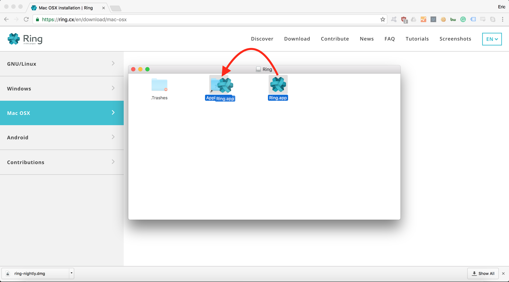

How to Download and Install Ring on MacOS/OS X (English)
******************************************

**Step 1.**

Go to https://ring.cx/en/download/mac-osx, and click on the "Get Ring" button.

**Step 2.**

Save the .dmg file to your computer.

**Step 3.**

Open the .dmg file, and you should see a shortcut to your *Applications* folder and *Ring.app*.

.. image:: download-install-5-open_dmg.png

**Step 4.**

Install the *Ring.app* by dragging it into the Applications folder.

*Note*: you can also copy-paste it into the Applications folder (cmd+c, followed by cmd+v).

**Step 5.**

Click on the Applications shortcut and then right-click on Ring.app to open it. If you open it from the *Launchpad* or by double-clicking on it, you'll receive the following error message:

.. image:: download-install-7-unidentified_developer.png

The proper way (you must have administrator privileges on your account):

**Step 6.**

It'll now launch Ring, and a pop-up will appear asking you to accept incoming connections. Click on "Allow".

**Congratulations! You've successfully installed Ring.**
